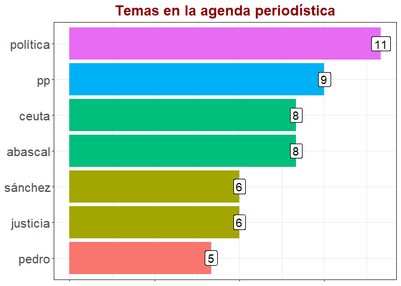

# Web Scraping en R con el paquete rvest

## ¿Qué es el Web Scraping?

Se denomina ‘web scraping’ (en inglés = arañado o raspado web) a la
extracción (automatizada y dirigida) y almacenamiento computacional del
contenido de páginas web. La información raspada puede ser de diverso
tipo. Por ejemplo, contactos telefónicos, correo electrónico,
direcciones físicas, información censal, notas periodísticas o de
opinión, comentarios de lectorxs, precios, etc. Esta información se
almacena en formatos diversos: vectores lógicos, numéricos o de texto
plano, marcos de datos, tablas, listas, matrices, arrays. Los objetos de
clase arrays son poco usuales. En este encuentro nos vamos a centrar en
los objetos de tipo tabular (tibbles y data frames). También usaremos
objetos de clase lista y vector.

En términos generales, el web scraping toma información web
semi-estructurada y la devuelve en un formato estructurado. Como
dijimos, aquí usaremos el formato tibble.

## Web Scraping y el giro digital

En las últimas dos décadas el crecimiento de la información online se
dio de forma acelerada, al punto de tornar imprescindible el uso del
raspado web para la recuperación masiva de parte de esa información
nacida digital. Internet alberga una cantidad infinita de datos
“extraibles”. Parte de esta información subyace en bases de datos,
detrás de API o en texto plano enmarcados en estructuras HTML/XML. Como
vimos en los encuentros anteriores, por distintas razones podemos querer
obtener información de redes sociales como Twitter o de foros de
usuarixs para ver qué está pensando la población sobre distintos temas y
tópicos. De todas formas, la accesibilidad no siempre está al alcance de
la mano, muchas páginas web bloquean el acceso mediante programación o
configuran “muros de pago” que requieren que se suscriba a una API para
acceder. Esto es lo que hacen, por ejemplo, *The New York Times* y *El
ABC*. Pero, finalmente, esas medidas no son una traba definitiva.
Existen muchas formas para obtener los datos que nos interesan.

## El Web Scraping y su legalidad

En términos generales, el raspado web (no comercial) de información
publicada en la web y de acceso público no es ilegal. Sin embargo,
existen protocolos de buenas prácticas de raspado que debemos intentar
respetar por cuestiones éticas. Para más detalles sobre este asunto
pueden leer los siguientes artículos: James Phoenix (2020) [‘Is Web
Scraping Legal?’](https://understandingdata.com/is-web-scraping-legal/),
Tom Waterman (2020) [‘Web scraping is now
legal’](https://medium.com/@tjwaterman99/web-scraping-is-now-legal-6bf0e5730a78),
Krotov, V., Johnson, L., & Silva, L. (2020) [‘Tutorial: Legality and
Ethics of Web
Scraping’](https://aisel.aisnet.org/cgi/viewcontent.cgi?article=4240&context=cais),
Edward Roberts (2018) [‘Is Web Scraping Illegal? Depends on What the
Meaning of the Word
Is’](https://www.imperva.com/blog/is-web-scraping-illegal/).

## ¿Para qué hacer Web Scraping?

Los usos del raspado web son infinitamente variados. Todo depende del
problema que queramos resolver. Puede ser la recuperación de la serie
histórica de precios de los pasajes de autobús en la ciudad de Mar del
Plata. O el análisis de las tendencias actuales en las agendas
periodísticas en la prensa española. Quizás la detección de cambios en
el lenguaje a lo largo del tiempo referido al uso del lenguaje
inclusivo, por ejemplo. O el monitoreo del humor social en determinado
lugar y tiempo en torno a tópicos políticos, sociales, culturales o
económicos. Etcétera. Etcétera. Etcétera. O el análisis de la
conflictividad social visibilizada en la prensa online, que es lo que
nos ocupa.

Todo esto es independiente de la herramienta que usemos para hacer el
raspado web. Pero no es así en este TalleR 😉.

## ¿Cómo hacer Web Scraping en R?

Esta pregunta la vamos a responder con un enfoque práctico, gracias a
las funciones del paquete `rvest`.

Lo primero que vamos a hacer es activar los paquetes que vamos a
utilizar a lo largo de los ejercicios. El primero de los ejercicios nos
permitirá desarrollar una función de web scraping. En este caso
aplicaremos la función creada a un diario español: *El Mundo*. La
función nos permitirá quedarnos con los titulares de una de sus
secciones. Luego analizaremos esos titulares con técnicas de
tonkenización y, finalmente, visualizaremos los resultados con `ggplot2`
que nos devolverá un gráfico de barras con las palabras más frecuentes.
Esto nos permitirá tener un primer pantallazo sobre la agenda
periodística del periódico en cuestión. Sin más preámbulo, pasemos la
primer ejercicio.

### Ejercicio 1

¿Cuáles son los tópicos más importantes de la agenda del diario *El
Mundo* según las últimas notas de su sección ‘España’? Veamos:

    # Pueden copiar y pegar el script o descargarlo desde RStudio con esta línea de comando:
    # utils::download.file("https://estudiosmaritimossociales.org/ejercicio01.R", "ejercicio01.R")
    # Paquetes a cargar (función 'require()' es equivalente a la función 'library()') ----------------
    require(tidyverse)
    require(rvest)
    require(stringr)
    require(tidytext)
    # Creamos la función para raspar El Mundo cuyo nombre será 'scraping_EM()' ------------------------
    scraping_EM <- function (x){          # abro función para raspado web y le asigno un nombre: scraping_EM
      
      rvest::read_html(x) %>%             # llamo a la función read_html() para obtener el contenido de la página
        
        rvest::html_elements(".ue-c-cover-content__headline-group") %>%  # llamo a la función html_elements() y especifico las etiquetas de los títulos 
        
        rvest::html_text() %>%            # llamo a la función html_text() para especificar el formato 'chr' del título.
        
        tibble::as_tibble() %>%           # llamo a la función as_tibble() para transforma el vector en tabla 
        
        dplyr::rename(titulo = value)     # llamo a la función rename() para renombrar la variable 'value'
      
    }                                     # cierro la función para raspado web
    # Usamos la función para scrapear el diario El Mundo ----------------------------------------------
    (El_Mundo <- scraping_EM("https://www.elmundo.es/espana.html"))

    ## # A tibble: 67 x 1
    ##    titulo                                                                       
    ##    <chr>                                                                        
    ##  1 "Memoria. El Gobierno vasco castigará \"enaltecer el franquismo\" con hasta ~
    ##  2 "A contrapelo. La única oportunidad de P. S."                                
    ##  3 "Política. Casado se reafirma en la polémica con bascal: \"El PP nunca ha le~
    ##  4 "Ceuta. Vox presenta una iniciativa para revocar la declaración contra Abasc~
    ##  5 "Covid-19. El Gobierno emplaza a Aragonès a que reconsidere ir a la Conferen~
    ##  6 "Política. La misión imposible de regar la huerta valenciana con agua desala~
    ##  7 "Justicia. Corinna Larsen denuncia a Juan Carlos I por espionaje y acoso a t~
    ##  8 "'Procés'. El Tribunal de Cuentas ve indicios de ilegalidad en el aval de la~
    ##  9 "Justicia. La ex abogada de Podemos declara que trabajadores le confirmaron ~
    ## 10 "Sociedad. Más de un millón de niños vive en situación de pobreza en las gra~
    ## # ... with 57 more rows

    # Tokenizamos los títulos de la sección 'España' del periódico El Mundo ---------------------------
    El_Mundo %>%                                          # datos en formato tabular extraídos con la función scraping_EM()
      
      tidytext::unnest_tokens(                            # función para tokenizar
        
        palabra,                                          # nombre de la columna a crear
        
        titulo) %>%                                       # columna de datos a tokenizar
      
      dplyr::count(                                       # función para contar
        
        palabra) %>%                                      # columna de datos a contar
      
      dplyr::arrange(                                     # función para ordenar columnas
        
        dplyr::desc(                                      # orden decreciente
          
          n)) %>%                                         # columna de frecuencia a ordenar en forma decreciente
      
      dplyr::filter(n > 4) %>%                            # filtramos y nos quedamos con las frecuencias mayores a 2
      
      dplyr::filter(!palabra %in% 
                      tm::stopwords("es")) %>%            # filtramos palabras comunes
      
      dplyr::filter(palabra != "españa") %>%              # filtro comodín
      
      dplyr::filter(palabra != "años") %>%                # filtro comodín
      
      ggplot2::ggplot(                                    # abrimos función para visualizar
        
        ggplot2::aes(                                     # definimos el mapa estético del gráfico
          
          y = n,                                          # definimos la entrada de datos de y
          
          x = stats::reorder(                             # definimos la entrada de datos de x
            
            palabra,                                      # con la función reorder() 
            
            + n                                           # para ordenar de mayor a menos la frecuencia de palabras
            
          )                                               # cerramos la función reorder()
          
        )                                                 # cerramos la función aes()
        
      ) +                                                 # cerramos la función ggplot()
      
      ggplot2::geom_bar(                                  # abrimos la función geom_bar()
        
        ggplot2::aes(                                     # agregamos parámetros a la función aes()
          
          fill = as_factor(n)                             # definimos los colores y tratamos la variable n como factores
          
        ),                                                # cerramos la función aes()
        
        stat = 'identity',                                # definimos que no tiene que contar, que los datos ya están agrupados 
        
        show.legend = F) +                                # establecemos que se borre la leyenda
      
      ggplot2::geom_label(                                # definimos las etiquetas de las barras
        
        aes(                                              # agregamos parámetros a la función aes()
          
          label = n                                       # definimos los valores de ene como contenido de las etiquetas
          
        ),                                                # cerramos la función aes()
        
        size = 5) +                                       # definimos el tamaño de las etiquetas
      
      ggplot2::labs(                                      # definimos las etiquetas del gráfico
            
        title = "Temas en la agenda periodística",        # definimos el título
        
        x = NULL,                                         # definimos la etiqueta de la x
        
        y = NULL                                          # definimos la etiqueta de la y
        
      ) +                                                 # cerramos la función labs()
      
      ggplot2::coord_flip() +                             # definimos que las barras estén acostadas                     
      
      ggplot2::theme_bw() +                               # definimos el tema general del gráfico
      
      ggplot2::theme(                                     # definimos parámetros para los ejes
        
        axis.text.x = 
          ggplot2::element_blank(),                       # definimos que el texto del eje x no se vea
        
        axis.text.y = 
          ggplot2::element_text(                          # definimos que el texto del eje y 
            
            size = 16                                     # definimos el tamaño del texto del eje y
            
          ),                                              # cerramos la función element_text()
        
        plot.title = 
          ggplot2::element_text(                          # definimos la estética del título
            
            size = 18,                                    # definimos el tamaño
            
            hjust = .5,                                   # definimos la alineación 
            
            face = "bold",                                # definimos el grosor de la letra
            
            color = "darkred"                             # definimos el color de la letra
            
          )                                               # cerramos la función element_text()
        
      )                                                   # cerramos la función theme()

Parece que durante los últimos días los temas centrales fueron la covid,
las políticas publicas en torno al coronavirus (toque de queda,
restricciones, confinamiento), disputas políticas entre el gobierno y la
oposición.

### Ejercicio 2

Gracias al Ejercicio 1 tenemos una idea general sobre cómo y para qué
hacer web scraping. En el ejercicio 1 hicimos todo en uno, desde la
extracción hasta la visualización. Ahora nos ocuparemos de ir paso a
paso. Además, haremos un raspado un poco más profundo.

Arranquemos por la función de web scraping:

    # Pueden copiar y pegar o descargarlo desde RStudio con esta línea de comando:
    # utils::download.file("https://estudiosmaritimossociales.org/ejercicio02.R", "ejercicio02.R")
    # Paquetes a cargar (función 'require()' es equivalente a la función 'library()') ----------------
    require(dplyr)
    require(rvest)
    require(tibble)
    # Creamos la función para raspar El País cuyo nombre será 'scraping_links()' ---------------------
    scraping_links <- function(pag_web, tag_link) {   # abro función para raspado web y le asigno un nombre: scraping_links.
      
      rvest::read_html(pag_web) %>%                   # llamo a la función read_html() para obtener el contenido de la página.
        
        rvest::html_elements(tag_link) %>%            # llamo a la función html_elements() y especifico las etiquetas de los títulos 
        
        rvest::html_attr("href") %>%                  # llamo a la función html_attr() para especificar el formato 'chr' del título.
        
        rvest::url_absolute(pag_web) %>%              # llamo a la función url::absolute() para completar las URLs relativas
        
        tibble::as_tibble() %>%                       # llamo a la función as_tibble() para transforma el vector en tabla
        
        dplyr::rename(link = value)                   # llamo a la función rename() para renombrar la variable 'value'
      
    }                                                 # cierro la función para raspado web
    # Usamos la función para scrapear el diario El Mundo ----------------------------------------------
    (links_EM <- scraping_links(pag_web = "https://www.elmundo.es/economia.html", tag_link = "a.ue-c-cover-content__link"))

    ## # A tibble: 66 x 1
    ##    link                                                                         
    ##    <chr>                                                                        
    ##  1 https://www.elmundo.es/economia/2021/07/27/61000ea3e4d4d8980a8b461c.html     
    ##  2 https://www.elmundo.es/economia/actualidad-economica/2021/07/28/61001bf221ef~
    ##  3 https://www.elmundo.es/economia/empresas/2021/07/26/60feea9bfdddff55a08b463b~
    ##  4 https://www.elmundo.es/economia/actualidad-economica/2021/07/28/60fffd65e4d4~
    ##  5 https://www.elmundo.es/economia/actualidad-economica/2021/07/27/60fea9bee4d4~
    ##  6 https://www.elmundo.es/economia/actualidad-economica/2021/07/27/60fead0921ef~
    ##  7 https://www.elmundo.es/economia/empresas/2021/07/27/61003429fc6c8366168b4572~
    ##  8 https://www.elmundo.es/economia/macroeconomia/2021/07/27/61000684fc6c83a3438~
    ##  9 https://www.elmundo.es/economia/actualidad-economica/2021/07/26/60fb0ed0e4d4~
    ## 10 https://www.elmundo.es/economia/empresas/2021/07/27/60ffbc2e21efa0516e8b4633~
    ## # ... with 56 more rows

    # Usamos la función para scrapear el diario El País -----------------------------------------------
    (links_EP <- scraping_links(pag_web = "https://elpais.com/espana/", tag_link = "h2 a")) 

    ## # A tibble: 27 x 1
    ##    link                                                                         
    ##    <chr>                                                                        
    ##  1 https://elpais.com/espana/2021-07-27/el-gobierno-obvia-las-criticas-y-apuest~
    ##  2 https://elpais.com/espana/2021-07-28/la-abogacia-del-estado-defendio-ante-el~
    ##  3 https://elpais.com/espana/2021-07-28/el-matrimonio-ruso-kokorev-vendio-679-m~
    ##  4 https://elpais.com/espana/2021-07-27/el-pp-respalda-a-su-lider-en-ceuta-y-ll~
    ##  5 https://elpais.com/espana/2021-07-27/el-buscador-de-fusilados-de-la-fosa-114~
    ##  6 https://elpais.com/espana/catalunya/2021-07-27/un-conseller-catalan-vuelve-a~
    ##  7 https://elpais.com/espana/2021-07-27/espana-y-marruecos-negocian-una-revisio~
    ##  8 https://elpais.com/espana/2021-07-27/el-tribunal-de-cuentas-pide-un-informe-~
    ##  9 https://elpais.com/espana/2021-07-27/las-auditorias-al-sector-publico-andalu~
    ## 10 https://elpais.com/espana/catalunya/2021-07-26/junts-desdena-la-mesa-de-dial~
    ## # ... with 17 more rows

Cumplido el primer paso (la obtención de los links a las notas
completas), nos toca construir una función para ‘raspar’ el contenido
completo de cada nota. ¡Manos a la obra!

    # Paquetes a cargar (función 'require()' es equivalente a la función 'library()') ----------------
    require(dplyr)
    require(rvest)
    require(tibble)
    # Creamos la función para raspar El País cuyo nombre será 'scraping_links()' ---------------------
    scraping_notas <- function(pag_web, tag_fecha, tag_titulo, tag_nota) { # abro función para raspado web: scraping_notas().
      
      tibble::tibble(                               # llamo a la función tibble.
      
      fecha = rvest::html_elements(                 # declaro la variable fecha y llamo a la función html_elements().
        
        rvest::read_html(pag_web), tag_fecha) %>%   # llamo a la función read_html(pag_web) y especifico la(s) etiqueta(s) de la fecha. 
        
        rvest::html_text(),                         # llamo a la función html_text() para especificar el formato 'chr' de la fecha.
      
      titulo = rvest::html_elements(                   # declaro la variable titulo y llamo a la función html_elements().
        
        rvest::read_html(pag_web), tag_titulo) %>%  # llamo a la función read_html(pag_web) y especifico la(s) etiqueta(s) del titulo.  
        
        rvest::html_text(),                         # llamo a la función html_text() para especificar el formato 'chr' del título.
      
      nota = rvest::html_elements(                     # declaro la variable nota y llamo a la función html_elements(). 
        
        rvest::read_html(pag_web), tag_nota) %>%    # llamo a la función html_elements() y especifico la(s) etiqueta(s) de la nota. 
        
        rvest::html_text()                          # llamo a la función html_text() para especificar el formato 'chr' del título.
      
      )                                             # cierro la función tibble().
      
    }                                               # cierro la función para raspado web.
    # Usamos la función para scrapear las notas del diario El País u otras páginas web ---------------------------
    (notas_EP  <- scraping_notas(pag_web = "https://elpais.com/espana/2021-01-16/madrid-una-semana-enterrada-en-la-nieve.html", 
                                 tag_fecha = ".a_ti",
                                 tag_titulo = "h1",
                                 tag_nota = ".a_b")) 

    ## # A tibble: 1 x 3
    ##   fecha          titulo                 nota                                    
    ##   <chr>          <chr>                  <chr>                                   
    ## 1 17 ene 2021 -~ Madrid: una semana en~ El portavoz de la Agencia Estatal de Me~

Resultó bien, pero ya tenemos un primer problema de normalización: el
formato de la fecha. Cuando miramos el tibble vemos que la variable
fecha es identificada y tratada como de tipo ‘chr’ (caracter). Debemos
transformarla en una variable de tipo ‘date’ (fecha). ¿Cómo lo hacemos?
Hay muchas formas. Acá vamos a hacerlo en dos pasos. Primero vamos a
quedarnos con los 11 caracteres iniciales (“dd mmm yyyy”) y luego
removemos los restantes. Finalmente, transformamos esos 11 caracteres en
un valor ‘date’ con la función `dmy()` del paquete `lubridate` de
`tidyverse`. Veamos cómo…

    # Paquetes a cargar (función 'require()' es equivalente a la función 'library()') ----------------
    require(lubridate)
    require(stringr)
    require(magrittr)
    fecha_sin_normalizar <- "16 ene 2021 - 23:30 UTC"   # creamos el objeto 'fecha_sin_normalizar'.
    (stringr::str_sub(fecha_sin_normalizar, 1, 11) %>%  # llamamos a la función str_sub() para quedarnos con los primeros 11 caracteres.   
      
      stringr::str_replace_all("ene", "jan") %>%        # llamamos a la función str_remplace_all() para cambiar la denominación de los mes.             
      stringr::str_replace_all("abr", "apr") %>% 
      stringr::str_replace_all("ago", "aug") %>% 
      stringr::str_replace_all("dic", "dec") %>% 
      
      lubridate::dmy() -> fecha_normalizada)            # finalmente llamamos a la función dmy() para transformar el string en un valor tipo 'date'.

    ## [1] "2021-01-16"

    base::class(fecha_normalizada)                      # examinamos su clase.

    ## [1] "Date"

Bien. Hemos logrado transformar la cadena de caracteres que contenía la
fecha en un valor que R reconoce y trata como ‘date’. Sin embargo,
seguimos con un problema no menor. Pudimos recuperar con al función
scraping\_notas() el contenido de una nota, pero la idea es recuperar el
contenido de un set completo de notas. Para lograrlo tendremos que hacer
uso de una nueva función de la familia tidyverse que perteneciente al
paquete `purrr`. Nos referimos a la función `pmap_dfr()`. Esta función
es una variante de la función `map()` de `purrr` que itera sobre
múltiples argumentos simultáneamente y en paralelo.

    # Paquetes a cargar (función 'require()' es equivalente a la función 'library()') ----------------
    require(dplyr)
    require(rvest)
    require(tibble)
    require(purrr)
    # Creamos la función para raspar los links a las notas cuyo nombre será 'scraping_links()' -------
    scraping_links <- function(pag_web, tag_link) {   # abro función para raspado web y le asigno un nombre: scraping_links
      
      rvest::read_html(pag_web) %>%                   # llamo a la función read_html() para obtener el contenido de la página
        
        rvest::html_elements(tag_link) %>%            # llamo a la función html_elements() y especifico las etiquetas de los títulos 
        
        rvest::html_attr("href") %>%                  # llamo a la función html_attr() para especificar el formato 'chr' del título.
        
        rvest::url_absolute(pag_web) %>%              # llamo a la función url::absolute() para completar las URLs relativas
        
        tibble::as_tibble() %>%                       # llamo a la función as_tibble() para transforma el vector en tabla
        
        dplyr::rename(link = value)                   # llamo a la función rename() para renombrar la variable 'value'
      
    }                                                 # cierro la función para raspado web
    # Usamos la función para scrapear los links a las notas de El País -------------------------------
    (links_EP  <- scraping_links(pag_web = "https://elpais.com/espana/", tag_link = "h2 a")) 

    ## # A tibble: 27 x 1
    ##    link                                                                         
    ##    <chr>                                                                        
    ##  1 https://elpais.com/espana/2021-07-27/el-gobierno-obvia-las-criticas-y-apuest~
    ##  2 https://elpais.com/espana/2021-07-28/la-abogacia-del-estado-defendio-ante-el~
    ##  3 https://elpais.com/espana/2021-07-28/el-matrimonio-ruso-kokorev-vendio-679-m~
    ##  4 https://elpais.com/espana/2021-07-27/el-pp-respalda-a-su-lider-en-ceuta-y-ll~
    ##  5 https://elpais.com/espana/2021-07-27/el-buscador-de-fusilados-de-la-fosa-114~
    ##  6 https://elpais.com/espana/catalunya/2021-07-27/un-conseller-catalan-vuelve-a~
    ##  7 https://elpais.com/espana/2021-07-27/espana-y-marruecos-negocian-una-revisio~
    ##  8 https://elpais.com/espana/2021-07-27/el-tribunal-de-cuentas-pide-un-informe-~
    ##  9 https://elpais.com/espana/2021-07-27/las-auditorias-al-sector-publico-andalu~
    ## 10 https://elpais.com/espana/catalunya/2021-07-26/junts-desdena-la-mesa-de-dial~
    ## # ... with 17 more rows

    # Creamos la función para raspar El País cuyo nombre será 'scraping_links()' ---------------------
    scraping_notas <- function(pag_web, tag_fecha, tag_titulo, tag_nota) { # abro función para raspado web: scraping_notas().
      
      tibble::tibble(                               # llamo a la función tibble.
      
      fecha = rvest::html_elements(                 # declaro la variable fecha y llamo a la función html_elements().
        
        rvest::read_html(pag_web), tag_fecha) %>%   # llamo a la función read_html(pag_web) y especifico la(s) etiqueta(s) de la fecha. 
        
        rvest::html_text(),                         # llamo a la función html_text() para especificar el formato 'chr' de la fecha.
      
      titulo = rvest::html_elements(                # declaro la variable titulo y llamo a la función html_elements().
        
        rvest::read_html(pag_web), tag_titulo) %>%  # llamo a la función read_html(pag_web) y especifico la(s) etiqueta(s) del titulo.  
        
        rvest::html_text(),                         # llamo a la función html_text() para especificar el formato 'chr' del título.
      
      nota = rvest::html_elements(                  # declaro la variable nota y llamo a la función html_elements(). 
        
        rvest::read_html(pag_web), tag_nota) %>%    # llamo a la función html_elements() y especifico la(s) etiqueta(s) de la nota. 
        
        rvest::html_text()                          # llamo a la función html_text() para especificar el formato 'chr' del título.
      
      )                                             # cierro la función tibble().
      
    }                                               # cierro la función para raspado web.
    # Seleccionamos los links que refieren a la sección que nos interesa y nos quedamos solo con 10 notas --------
    (links_EP_limpio <- links_EP %>% filter(str_detect(link, "https://elpais.com/espana/")) %>% filter(!str_detect(link,"en-clave-de-bienestar")) %>% .[1:10,])

    ## # A tibble: 10 x 1
    ##    link                                                                         
    ##    <chr>                                                                        
    ##  1 https://elpais.com/espana/2021-07-27/el-gobierno-obvia-las-criticas-y-apuest~
    ##  2 https://elpais.com/espana/2021-07-28/la-abogacia-del-estado-defendio-ante-el~
    ##  3 https://elpais.com/espana/2021-07-28/el-matrimonio-ruso-kokorev-vendio-679-m~
    ##  4 https://elpais.com/espana/2021-07-27/el-pp-respalda-a-su-lider-en-ceuta-y-ll~
    ##  5 https://elpais.com/espana/2021-07-27/el-buscador-de-fusilados-de-la-fosa-114~
    ##  6 https://elpais.com/espana/catalunya/2021-07-27/un-conseller-catalan-vuelve-a~
    ##  7 https://elpais.com/espana/2021-07-27/espana-y-marruecos-negocian-una-revisio~
    ##  8 https://elpais.com/espana/2021-07-27/el-tribunal-de-cuentas-pide-un-informe-~
    ##  9 https://elpais.com/espana/2021-07-27/las-auditorias-al-sector-publico-andalu~
    ## 10 https://elpais.com/espana/catalunya/2021-07-26/junts-desdena-la-mesa-de-dial~

    # Usamos la función pmap_dfr() para emparejar los links y la función de web scraping y creamos el objeto el_pais_esp con las 10 notas completas
    (el_pais_esp <-                     # abrimos la función print '(' y asignamos un nombre al objeto que vamos a crear.
        
        purrr::pmap_dfr(                # llamamos a la función pmap_dfr() para emparejar links y función de rascado.
          
          base::list(                   # Llamamos a la función list() para crear una lista con los múltiples argumentos de la función de rascado.
            
            links_EP_limpio$link,       # vector de links.
            
            ".a_ti",                    # etiqueta de fecha.
            
            "h1",                       # etiqueta de título.
            
            ".a_b"),                    # etiqueta de nota y cierro la función list().
          
          scraping_notas))              # función scraping_notas() sin los `()` y cierro la función pmap_dfr() y la función print `)`.

    ## # A tibble: 10 x 3
    ##    fecha        titulo                           nota                           
    ##    <chr>        <chr>                            <chr>                          
    ##  1 27 jul 2021~ "El Gobierno obvia las críticas~ "“La Conferencia de Presidente~
    ##  2 28 jul 2021~ "La abogacía del Estado defendi~ "El extesorero del PP Luis Bár~
    ##  3 28 jul 2021~ "El matrimonio ruso Kokorev ven~ "Vladimir Kokorev durante la v~
    ##  4 27 jul 2021~ "El PP respalda a su líder en C~ "El líder de Vox, Santiago Aba~
    ##  5 27 jul 2021~ "El buscador de fusilados de la~ "—Hola. Soy David Coronado. Es~
    ##  6 27 jul 2021~ "Un ‘conseller’ catalán vuelve ~ "El presidente catalán, Pere A~
    ##  7 27 jul 2021~ "España y Marruecos negocian un~ "Hace ya dos meses y 10 días q~
    ##  8 27 jul 2021~ "El Tribunal de Cuentas pide un~ "Francesc Homs, Artur Mas y Ca~
    ##  9 27 jul 2021~ "Las auditorías al sector públi~ "El portavoz del Gobierno anda~
    ## 10 26 jul 2021~ "Junts ataca el diálogo con Sán~ "Que ERC y Junts, socios en el~

    # Usamos la función para scrapear los links a las notas de La Nación -------------------------------
    (links_LN <- scraping_links(pag_web = "https://www.lanacion.com.ar/politica", tag_link = "h2 a"))

    ## # A tibble: 30 x 1
    ##    link                                                                         
    ##    <chr>                                                                        
    ##  1 https://www.lanacion.com.ar/politica/un-gobierno-que-no-dice-la-verdad-nid27~
    ##  2 https://www.lanacion.com.ar/politica/luis-brandoni-cuestiono-a-facundo-manes~
    ##  3 https://www.lanacion.com.ar/lnmas/hernan-lacunza-el-dolar-hara-por-las-malas~
    ##  4 https://www.lanacion.com.ar/politica/la-insolita-cumbia-de-guillermo-moreno-~
    ##  5 https://www.lanacion.com.ar/politica/pedir-licencia-o-renunciar-antes-del-10~
    ##  6 https://www.lanacion.com.ar/politica/luis-majul-por-que-siguen-funcionando-c~
    ##  7 https://www.lanacion.com.ar/politica/tragedia-en-la-academia-de-matias-almey~
    ##  8 https://www.lanacion.com.ar/politica/prorroga-del-material-belico-en-bolivia~
    ##  9 https://www.lanacion.com.ar/politica/facundo-manes-ningun-politico-va-a-dar-~
    ## 10 https://www.lanacion.com.ar/politica/facundo-moyano-propone-estatizar-dos-au~
    ## # ... with 20 more rows

    # Usamos la función para scrapear las notas de La Nación. Replicamos todo en una sola línea de código.
    (la_nacion_ar <- purrr::pmap_dfr(list(links_LN$link[1:10],".com-date.--twoxs",".com-title.--threexl",".col-12 p"), scraping_notas))

    ## # A tibble: 92 x 3
    ##    fecha         titulo               nota                                      
    ##    <chr>         <chr>                <chr>                                     
    ##  1 28 de julio ~ Un gobierno que no ~ El gobierno del presidente Alberto Fernán~
    ##  2 28 de julio ~ Un gobierno que no ~ Ayer hubo dos noticias que son ejemplos c~
    ##  3 28 de julio ~ Un gobierno que no ~ La otra noticia fue la firma de un contra~
    ##  4 28 de julio ~ Un gobierno que no ~ La denuncia contra Macri por su complicid~
    ##  5 28 de julio ~ Un gobierno que no ~ La embajada argentina en Bolivia refugió ~
    ##  6 28 de julio ~ Un gobierno que no ~ La denuncia nació viciada en el origen mi~
    ##  7 28 de julio ~ Un gobierno que no ~ El armamento de la Gendarmería fue enviad~
    ##  8 28 de julio ~ Un gobierno que no ~ El entonces embajador argentino en Bolivi~
    ##  9 28 de julio ~ Un gobierno que no ~ Menos de un mes después del envío de esas~
    ## 10 28 de julio ~ Un gobierno que no ~ Además, el kirchnerismo le tiene especial~
    ## # ... with 82 more rows

    # Guardamos el objeto 'la_nacion_ar' como objeto .rds
    base::saveRDS(la_nacion_ar, "la_nacion_ar.rds")

Bueno, parece que finalmente realizamos todos los pasos para hacer un
web scraping completo. Pero esto no termina aquí. Seguro notaron que las
notas se trasformaron de 10 a 100, esto puede ser contraproducente en el
momento del análisis. Tenemos que normalizar la base. ¡Hagámoslo!

    # Paquetes a cargar (función 'require()' es equivalente a la función 'library()') ----------------
    require(dplyr)
    require(rvest)
    require(tibble)
    require(stringr)
    require(tidyr)
    require(lubridate)
    # Cargamos el objeto la_nacion_ar.
    la_nacion_ar <- base::readRDS("la_nacion_ar.rds")
    # Imprimimos en consola sus valores completos, las notas completas.
    la_nacion_ar$nota[1:30] # los corchetes me permiten seleccionar los valores según su número de fila

    ##  [1] "El gobierno del presidente Alberto Fernández tiene un conflicto con la verdad. Cada tanto, o a cada rato, se descubre que afirmaciones de él o de sus funcionarios no son ciertas. También hubo, en algunos casos, manifiestas manipulaciones de los datos para que estos coincidan con una supuesta realidad, que nunca es la realidad. El resultado fácilmente perceptible es que la palabra presidencial ha perdido valor. Peor: ha perdido credibilidad. Es una noticia extremadamente mala para cualquier presidente (y para cualquier país)."                                                                                                                                                                                                                                                                                                                                                                                                                                                                                                                                                                                                                                                                                                       
    ##  [2] "Ayer hubo dos noticias que son ejemplos cabales de esa insistencia presidencial en cambiar el eje de los hechos con palabras inexactas. Una fue la nota enviada a la Justicia por la Agencia Nacional de Materiales Controlados (ANMAC) en la que señala que Alberto Fernández prorrogó dos veces la permanencia de las 70.000 municiones enviadas a Bolivia. El envío de ese armamento a Bolivia, decidido inicialmente por el gobierno de Mauricio Macri, motivó una denuncia del gobierno kirchnerista contra el expresidente por haber contribuido supuestamente a un “golpe de Estado” contra el entonces gobierno boliviano de Evo Morales."                                                                                                                                                                                                                                                                                                                                                                                                                                                                                                                                                                                                        
    ##  [3] "La otra noticia fue la firma de un contrato con el laboratorio Pfizer para la compra de 20 millones de dosis de su vacuna contra el coronavirus, después de 13 meses de negociaciones frustradas. Fuentes oficiales reconocen que Pfizer pasó a ser una opción razonable cuando todas las otras opciones (Sputnik V, AstraZeneca, Sinopharm y Sinovac) fracasaron. Muy atrás quedaron los tiempos en que Pfizer ponía “condiciones inaceptables”, según la explicación del exministro de Salud Ginés González García sobre la ruptura con el laboratorio norteamericano."                                                                                                                                                                                                                                                                                                                                                                                                                                                                                                                                                                                                                                                                                 
    ##  [4] "La denuncia contra Macri por su complicidad con el golpe contra Evo Morales encierra varias contradicciones. La primera de ellas es que Morales no cayó como víctima de un golpe de Estado. Un sector importante de la sociedad se sublevó cuando era evidente que se estaba cometiendo fraude en una elección que perpetuaría a Morales en el poder. Después de días de violencia y represión (fueron violentos los sublevados y fue violenta la represión) los jefes militares le “aconsejaron” a Morales que renunciara. Es una presión militar inaceptable para cualquier mirada argentina, pero resulta que esa participación de los uniformados está contemplada en la Constitución de Bolivia. Morales renunció y sus opositores lo persiguieron a él, a su gobierno y a su familia."                                                                                                                                                                                                                                                                                                                                                                                                                                                              
    ##  [5] "La embajada argentina en Bolivia refugió a dos hijos de Evo Morales en esos días en los que la seguridad era una ausencia. El excanciller argentino Jorge Faurie señaló que su gobierno mantenía permanente conversaciones con el ya gobierno electo de Alberto Fernández para coordinar las acciones en Bolivia. Un hijo de Morales eligió viajar a México; el otro vino a la Argentina. Macri gobernaba la Argentina en sus últimos días en el poder. También exfuncionarios de Evo Morales fueron refugiados en la sede de la representación diplomática argentina. ¿Macri auspiciaba un presunto golpe en Bolivia contra Morales mientras daba refugio en la embajada argentina a familiares y exfuncionarios de Morales? Solo el prejuicio, el rencor o la competencia electoral pueden sostener semejantes incoherencias."                                                                                                                                                                                                                                                                                                                                                                                                                          
    ##  [6] "La denuncia nació viciada en el origen mismo. El actual canciller boliviano, Rogelio Mayta, mostró una carta del exjefe de la aviación boliviana Jorge Terceros Lara en la que le agradecía al gobierno argentino el envío de 70.000 municiones para reprimir a los seguidores de Evo Morales. La carta está fechada el 13 de noviembre de 2019. Morales renunció dos días antes, el 11 de noviembre. Es decir que en un solo día el gobierno argentino había enviado las municiones que necesitaban los “golpistas” y el nuevo gobierno boliviano le agradecía el gesto."                                                                                                                                                                                                                                                                                                                                                                                                                                                                                                                                                                                                                                                                                
    ##  [7] "El armamento de la Gendarmería fue enviado a Bolivia, según explicó siempre el gobierno de Macri, para proteger a la embajada argentina, en la que se encontraban refugiados familiares y exfuncionarios de Morales y estaba siendo asediada por seguidores del nuevo gobierno, presidido por la parlamentaria Jeanine Áñez. El general de aviación Terceros Lara calificó luego de “falsificada” su firma en esa carta. El militar renunció a las 9 de la mañana del 13 de noviembre, el mismo día que supuestamente firmó la carta."                                                                                                                                                                                                                                                                                                                                                                                                                                                                                                                                                                                                                                                                                                                    
    ##  [8] "El entonces embajador argentino en Bolivia, Normando Álvarez García, aseguró que nunca había recibido esa supuesta carta (supuesta o presunta son palabras que deben repetirse en este caso). Álvarez García no es un político de Macri, sino del gobernador radical de Jujuy, Gerardo Morales, de cuyo gobierno es actualmente ministro de Trabajo. El sitio Bolivia Verifica, que es un centro de chequeo de información que depende de la Fundación para el Periodismo, calificó de “falsa” la carta de Terceros Lara."                                                                                                                                                                                                                                                                                                                                                                                                                                                                                                                                                                                                                                                                                                                                
    ##  [9] "Menos de un mes después del envío de esas municiones, el 10 de diciembre de 2019, Macri abandonaba el poder. La denuncia del canciller Mayta espoleó en la Argentina para que el kirchnerismo se apelotonara en los tribunales denunciando a Macri y a varios funcionarios suyos como cómplices del supuesto golpe de Estado contra Evo Morales. Los ministros de Seguridad y de Justicia, Sabina Frederic y Martín Soria, y hasta la jefa de la AFIP, Mercedes Marcó del Pont, se presentaron como querellantes en la denuncia contra el gobierno macrista."                                                                                                                                                                                                                                                                                                                                                                                                                                                                                                                                                                                                                                                                                             
    ## [10] "Además, el kirchnerismo le tiene especial aversión al exdirector de la Gendarmería Gerardo Otero desde la muerte de Santiago Maldonado. La autopsia de Maldonado, que estableció que murió ahogado y no tenía heridas de ningún tipo, no menguó el rencor del kirchnerismo contra el exjefe de la Gendarmería. La otra cara de la verdad es que Otero fue un jefe implacable de sus tropas en la lucha contra el narcotráfico. Meterlo ahora en las pobres peleas de la política es una decisión claramente injusta."                                                                                                                                                                                                                                                                                                                                                                                                                                                                                                                                                                                                                                                                                                                                     
    ## [11] "La carta de la Anmac revela varias cosas. La primera de ellas es que Alberto Fernández prorrogó la permanencia de esas municiones en Bolivia en dos ocasiones y por el plazo de tres meses cada una. Ya era 2020. Macri estaba en su casa desde hacía tiempo."                                                                                                                                                                                                                                                                                                                                                                                                                                                                                                                                                                                                                                                                                                                                                                                                                                                                                                                                                                                            
    ## [12] "Los armamentos de la Gendarmería argentina estuvieron en Bolivia más tiempo durante el gobierno de Alberto Fernández (alrededor de seis meses) que bajo la administración de Macri (un mes)."                                                                                                                                                                                                                                                                                                                                                                                                                                                                                                                                                                                                                                                                                                                                                                                                                                                                                                                                                                                                                                                             
    ## [13] "La otra sorpresa es que Alberto Fernández usó los mismos argumentos que Macri para extender la permanencia de esas municiones en el país vecino: “Brindar seguridad y protección al embajador y al personal de la embajada argentina en Bolivia”. Ni siquiera cambió las palabras que había usado el gobierno de Macri."                                                                                                                                                                                                                                                                                                                                                                                                                                                                                                                                                                                                                                                                                                                                                                                                                                                                                                                                  
    ## [14] "En Bolivia, seguía gobernando la supuesta golpista Jeanine Áñez. ¿Por qué el envío de municiones para proteger la embajada por parte de Macri fue un delito y no lo son las prórrogas que autorizó el gobierno de Alberto Fernández? El actual presidente de Bolivia, Luis Arce, le puso al asunto la coloratura que tiene: “Es lamentable que un gobierno de derecha haya participado de un golpe de Estado”, dijo."                                                                                                                                                                                                                                                                                                                                                                                                                                                                                                                                                                                                                                                                                                                                                                                                                                     
    ## [15] "Apareció el elemento evidente que nadie nombraba: la ideología. Los gobiernos de Arce y de Alberto Fernández son muy cercanos y tienen posiciones habitualmente comunes en asuntos de política exterior. ¿Hay mejor ejemplo de lawfare que el caso judicial del envío de armamentos a Bolivia? ¿O el lawfare es solo malo cuando la Justicia persigue a los dirigentes progresistas, pero es necesario y justo cuando lo hace con los de la derecha o de la centroderecha?"                                                                                                                                                                                                                                                                                                                                                                                                                                                                                                                                                                                                                                                                                                                                                                               
    ## [16] "En junio de 2020, hace 13 meses, el gobierno de Alberto Fernández inició negociaciones con el laboratorio Pfizer para comprar vacunas. El primer acuerdo consistió en que en la Argentina se realizaría el ensayo más grande del mundo en la investigación de la vacuna Pfizer. Participaron 5762 argentinos en el Hospital Militar bajo el control de un equipo médico cuyo jefe es el infectólogo Fernando Polack. En las primeras conversaciones se convino, según se supo después, que Pfizer enviaría al país desde diciembre del año pasado 13,2 millones de dosis. En diciembre pasado hubieran llegado más de 3 millones de dosis. Sin embargo, luego se conoció el compromiso con el gobierno ruso por la vacuna Sputnik V, con los chinos por las Sinopharm y Sinovac, y con el laboratorio anglo-sueco AstraZeneca, el único que entonces tenía un socio local. Entonces aparecieron las “condiciones inaceptables” de Pfizer denunciadas por González García o los “hechos violentos” de ese laboratorio explicados más tarde por el propio Presidente."                                                                                                                                                                                      
    ## [17] "Pero la opción de esas vacunas se fue desvaneciendo cuando los envíos se retrasaron. Hasta hoy. Hay siete millones de argentinos que esperan, atemorizados, la segunda dosis de la Sputnik V que nunca llega. Los amigos y la ideología se terminaron cuando la realidad golpeó las puertas del despacho presidencial: la Argentina tiene ahora solo al 13 por ciento de su sociedad vacunada con las dos dosis. La inmunización total de las personas es indispensable para enfrentar la variante Delta, que está azotando a países que tienen a más del 50 por ciento de su sociedad (algunos hasta el 70 por ciento) vacunada con las dos dosis. España les cerró las puertas a los argentinos, no porque no los quiera, sino por razones más prácticas que emocionales. España, que tiene a la mitad de su sociedad vacunada con las dos dosis, está sufriendo los estragos de la variante Delta; de hecho, tiene más casos de contagiados por 100.000 habitantes en los últimos 14 días que la Argentina. Pero el gobierno de Pedro Sánchez sabe que aquí todavía no explotó la variante Delta y que solo un 13 por ciento de la sociedad argentina está vacunada con las dos dosis. Solo se adelanta ante probables recaídas de la situación local."
    ## [18] "El Gobierno debería ser más sincero. No hubo un acuerdo con Pfizer después de largas negociaciones. Lo único nuevo es la desesperación del presidente argentino ante un futuro incierto, impredecible y voluble. No es necesario esconder la verdad con palabras que no son ciertas."                                                                                                                                                                                                                                                                                                                                                                                                                                                                                                                                                                                                                                                                                                                                                                                                                                                                                                                                                                     
    ## [19] ""                                                                                                                                                                                                                                                                                                                                                                                                                                                                                                                                                                                                                                                                                                                                                                                                                                                                                                                                                                                                                                                                                                                                                                                                                                                         
    ## [20] "Luis Brandoni, precandidato a diputado por Adelante Ciudad, lanzó una fuerte crítica al radical Facundo Manes, precandidato dela UCR en Buenos Aires. “Manes cometió una imprudencia”, dijo. Y se explayó al comentar que eso le ocurre porque “le falta práctica política”."                                                                                                                                                                                                                                                                                                                                                                                                                                                                                                                                                                                                                                                                                                                                                                                                                                                                                                                                                                             
    ## [21] "Brandoni se refiere a las declaraciones del neurocientífico, quien en el arranque de la contienda electoral manifestó: “Espero que no se gasten los impuestos de los porteños en la campaña”. Esto como un pedido al jefe de gobierno porteño Horacio Rodríguez Larreta para que no use fondos de la Ciudad para apoyar a Santilli en la interna de Juntos."                                                                                                                                                                                                                                                                                                                                                                                                                                                                                                                                                                                                                                                                                                                                                                                                                                                                                              
    ## [22] "Según el actor y político radical, que estuvo en Mesa Chica, por LN+, no hay que perder de vista que el objetivo es ganarle poder al kirchnerismo. Manes, al desconfiar del manejo de fondos de Larreta no colabora -según él- en esta línea. “Es una imprudencia, ha cometido una imprudencia y podría arreglarla”, pidió. “Aparecen este caso u otros que salen en búsqueda de algún titular importante y dicen cosas que no ayudan”."                                                                                                                                                                                                                                                                                                                                                                                                                                                                                                                                                                                                                                                                                                                                                                                                                  
    ## [23] "Para reforzar sus declaraciones contó una anécdota que vivió en México, en sus años de exilio. “Estados Unidos había devaluado el dólar. Le preguntaron al ministro de Economía de México de ese momento de qué manera esto iba a afectar a México. Y él dijo, muy suelto de cuerpo: ‘La devaluación no nos perjudica ni nos beneficia, sino todo lo contrario”. El estudio de LN+ estalló en risas, tras la humorada."                                                                                                                                                                                                                                                                                                                                                                                                                                                                                                                                                                                                                                                                                                                                                                                                                                   
    ## [24] "“¿Cómo aplica esto a Manes?”, le consultó la periodista Paz Rodríguez Niell. “No quiero personalizar. [Manes] No va a ser el único ni la única en decir cosas que no colaboran con los propósitos para la política”, dijo. Y ratificó que el espacio opositor, más allá de las diferencias, tiene que tener claro el “sano camino que siguen, que es el de quitarle el poder a esta gente” [por el Frente de Todos]."                                                                                                                                                                                                                                                                                                                                                                                                                                                                                                                                                                                                                                                                                                                                                                                                                                     
    ## [25] "Sobre el final, arriesgó: “Creo que vamos a ganar, porque estoy convencido de que la sociedad también cambió en algún sentido”. Por este motivo, espera que vuelvan a apoyar un proyecto contario al del kirchnerismo."                                                                                                                                                                                                                                                                                                                                                                                                                                                                                                                                                                                                                                                                                                                                                                                                                                                                                                                                                                                                                                   
    ## [26] "A su lado, el exministro de Mauricio Macri Hernán Lacunza coincidió con Brandoni: “Este inicio de Manes es un paso en falso”."                                                                                                                                                                                                                                                                                                                                                                                                                                                                                                                                                                                                                                                                                                                                                                                                                                                                                                                                                                                                                                                                                                                            
    ## [27] ""                                                                                                                                                                                                                                                                                                                                                                                                                                                                                                                                                                                                                                                                                                                                                                                                                                                                                                                                                                                                                                                                                                                                                                                                                                                         
    ## [28] "“Después del plan primavera viene el invierno”. Con esa frase lapidaria, el exministro de Economía, Hernán Lacunza, analizó la decisión del Gobierno de contener la inflación con “parches”."                                                                                                                                                                                                                                                                                                                                                                                                                                                                                                                                                                                                                                                                                                                                                                                                                                                                                                                                                                                                                                                             
    ## [29] "Apelando a metáforas, Lacunza dijo en Mesa Chica, por LN+, que el presidente Alberto Fernández apuesta a retrasar los malos indicadores pero consideró que eso agravará el problema el año que viene. "                                                                                                                                                                                                                                                                                                                                                                                                                                                                                                                                                                                                                                                                                                                                                                                                                                                                                                                                                                                                                                                   
    ## [30] "“Apuestan a una inflación del 3 por ciento mensual, pero el problema lo vamos a tener el año que viene. Esta inflación de 50 por ciento anual es peor que la de Macri, porque acá hay una inflación reprimida”, explicó."

    # Detectamos que hay algunas filas que son recurrente y debemos borrar:
       # "Celdas vacías"
    # Con el uso del paquete stringr vamos a remover estos fragmentos de información no útil.
    (la_nacion_ar_limpia <- la_nacion_ar %>%                                  # creamos un nuevo objeto clase tibble.
        
        dplyr::mutate(nota = stringr::str_trim(nota)) %>%                     # con las funciones mutate() y str_trim() quitamos los espacios en blanco sobrantes.
        
        dplyr::filter(nota != ""))                                         # con la función filter() descartamos las celdas vacías.

    ## # A tibble: 82 x 3
    ##    fecha         titulo               nota                                      
    ##    <chr>         <chr>                <chr>                                     
    ##  1 28 de julio ~ Un gobierno que no ~ El gobierno del presidente Alberto Fernán~
    ##  2 28 de julio ~ Un gobierno que no ~ Ayer hubo dos noticias que son ejemplos c~
    ##  3 28 de julio ~ Un gobierno que no ~ La otra noticia fue la firma de un contra~
    ##  4 28 de julio ~ Un gobierno que no ~ La denuncia contra Macri por su complicid~
    ##  5 28 de julio ~ Un gobierno que no ~ La embajada argentina en Bolivia refugió ~
    ##  6 28 de julio ~ Un gobierno que no ~ La denuncia nació viciada en el origen mi~
    ##  7 28 de julio ~ Un gobierno que no ~ El armamento de la Gendarmería fue enviad~
    ##  8 28 de julio ~ Un gobierno que no ~ El entonces embajador argentino en Bolivi~
    ##  9 28 de julio ~ Un gobierno que no ~ Menos de un mes después del envío de esas~
    ## 10 28 de julio ~ Un gobierno que no ~ Además, el kirchnerismo le tiene especial~
    ## # ... with 72 more rows

    # Ahora colapsaremos los párrafos de cada nota en una sola celda, de esta forma volveremos a un tibble de 10 filas (observaciones), una por nota.
    (la_nacion_ar_limpia_norm <- la_nacion_ar_limpia %>%                                # creamos un nuevo objeto clase tibble.
        
      dplyr::group_by(fecha, titulo) %>%                                                # con la función group_by() agrupamos por fecha y título.
        
      dplyr::summarise(nota_limpia = base::paste(nota, collapse = " ||| ")) %>%  # con las funciones summarise() y paste() colapsamos los párrafos.
      
      dplyr::select(fecha, titulo, nota_limpia) %>%                                     # con la función select() seleccionamos las variables. 
      
      dplyr::mutate(fecha = lubridate::dmy(fecha)))                                     # con las funciones mutate() y dmy() le damos formato date al string de fechas.

    ## # A tibble: 10 x 3
    ## # Groups:   fecha [2]
    ##    fecha      titulo                          nota_limpia                       
    ##    <date>     <chr>                           <chr>                             
    ##  1 2021-07-27 “No podemos importar noruegos”~ Facundo Manes, precandidato a dip~
    ##  2 2021-07-27 Facundo Moyano propone estatiz~ El diputado nacional Facundo Moya~
    ##  3 2021-07-27 La insólita cumbia de Guillerm~ Guillermo Moreno siempre tuvo un ~
    ##  4 2021-07-27 Luis Majul: “¿Por qué siguen f~ Luego de que se conociera que el ~
    ##  5 2021-07-27 Pedir licencia o renunciar ant~ Todavía no traspasó la categoría ~
    ##  6 2021-07-27 Prórroga del material bélico e~ El Gobierno asegura que las autor~
    ##  7 2021-07-27 Tragedia en la academia de Mat~ Un trágico hecho ocurrió hoy en e~
    ##  8 2021-07-28 Hernán Lacunza: “El dólar hará~ “Después del plan primavera viene~
    ##  9 2021-07-28 Luis Brandoni cuestionó a Facu~ Luis Brandoni, precandidato a dip~
    ## 10 2021-07-28 Un gobierno que no dice la ver~ El gobierno del presidente Albert~

    # Imprimimos en consola sus valores completos, las notas completas.
    la_nacion_ar_limpia_norm$nota_limpia[1:10] # los corchetes me permiten seleccionar los valores según su número de fila

    ##  [1] "Facundo Manes, precandidato a diputado por Juntos en la provincia de Buenos Aires, dijo, en diálogo con LN+, que “ningún político va a dar trabajo”. Sobre ese punto, profundizó: “Tenemos que dejar de mentirnos y hacer un plan de país basado en lo más urgente que es el desarrollo humano: la innovación y la creatividad”. ||| Además, ante las críticas que recibió de Victoria Tolosa Paz y Cristian Ritondo, respondió: “La Argentina está demasiado estresada como para que los candidatos nos critiquemos. Yo no voy a criticar a nadie”. ||| Manes también fue consultado por la crítica que le hizo Margarita Stolbizer, quien se mostró sorprendida por la presencia del exintendente de Malvinas Argentinas, Jesús Cariglino, en la lista.  “Es una alianza con Joaquín de la Torre, que es del peronismo republicano. Necesitamos cambiar la Argentina con los argentinos que se comprometan con este proyecto de país. No podemos importar noruegos, la renovación pasa con que todos los de la lista se comprometan con la Argentina del conocimiento”, dijo, con ironía. ||| En otro tramo de la entrevista, este médico especializado en neurociencia contó que tiene “dos pasiones: el cerebro y la Argentina”. Y reflexionó: “La educación fue lo que me cambió, yo no nací en una elite, pero la educación me dio la autoestima para cumplir mis sueños”. ||| Además, señaló que, antes de esta oportunidad, “tuvo muchas ofertas de todos los sectores, pero decía que no por que no entendía para qué, pensé que era parte de una boleta o una propuesta electoral”. ||| “No estoy destinado a que la gente me vote”, dijo. Y explicó que su decisión de postularse se debe a que “hay dolor y los médicos se dedican a acompañar el dolor y ayudar a sanar”. Siguiendo con esa reflexión, lanzó: “La Argentina está enferma. Tenemos un país que involuciona y no tiene futuro, pero somos resilientes”. ||| “Es un país frágil, había que reconstruir a la Argentina antes de la pandemia, imaginate ahora”, señaló Manes. Y resaltó: “Hay que recuperar el sentido común”. ||| “Estamos frente a la crisis de mayor dimensión de la historia, es la mayor crisis de salud de la historia moderna”, dijo y añadió que a eso se les suma la crisis económica y educativa. Sobre ese punto, proyectó que el impacto durará décadas. “Es hora de calmarnos y de decir que estamos mal. Estábamos mal antes de la pandemia, pero nadie puede tirar la primera piedra, hay que ser humilde”. ||| Siguiendo este punto, el precandidato puso el eje sobre el deterioro a la salud mental generado por la pandemia, y lanzó: “El impacto psicológico va a durar más que la pandemia”. “Nadie habla de salud mental, y la salud es una sola. Tanto como hablamos de vacunación, tenemos que hablar de salud mental”. ||| Tal como puntualizó Manes, su objetivo es “unir a los argentinos en base a un proyecto de país que hoy no tenemos” y “vamos a abordar el delito, pero también sus causas: la malnutrición, la marginalidad, la falta de oportunidades y la salud mental”."                                                                                                                                                                                                                                                                                                                                                                                                                                                                                                                                                                                                                                                                                                                                                                                                                                                                                                                                                                                                                                                                                                                                                                                                                                                                                                                                                                                                                                                                                                                                                                                                                                                                                                                                                                                                                                                                                                                                                                                                                                                                                                                                                                                                                                                                                                                                                                                                                                                                                                                                                                                                                                                                                                                                                                                                                                                                                                                                                                                                                                                                                                                                                                                                                                                                                                                                                                                                                                                                                                                                                                                                                                                                                                                                                                                                                                                                                                                                                                                                                                                                                                                                                                                                                                                                                                                                                                                                                                                                                                                                                                                                                                                                                                                                                                                                                                                                                                                                                                                                                                                                                                                                                                                                                                                                                                                                                                                                                                                                                                                                                                                                                                                                                                                                                                                                                                                                                                                                                                                                                                                                                                                                                                                                                                                                                                                                                                                                                                                                                                                                                                                                                                                                                                                                                                                                                                                                                                                                                                                                                                                                                                                                                                                                                                                                                                                                                                                                          
    ##  [2] "El diputado nacional Facundo Moyano, que representa al Frente de Todos en el Congreso de la Nación, presentó un proyecto de ley que aspira a la estatización de los peajes y el mantenimiento de las autopista Panamericana y del Acceso Oeste. La información se desprende del texto ingresado en mesa de entrada a fines de junio, que pondría la administración de las dos vías en una nueva empresa de mayoría pública, bautizada Autopistas Metropolitanas Sociedad Anónima (Aumet SA). ||| Con su propuesta, el parlamentario, que supo ser el secretario general del Sindicato Único de los Trabajadores de Peaje (Sutpa), que fundó en 2006, el 7% de la compañía Aumet SA será destinado a los empleados. Otro 10 % quedará en manos de un operador privado, mientras que el 83% quedaría en manos del Estado. ||| “La creación de Aumet debe ser entendida como una medida superadora, que permitirá la optimización de los recursos disponibles a fin de mejorar la infraestructura vial existente en el AMBA”, manifestó Moyano, en el texto de su proyecto de ley. ||| En este sentido, el diputado nacional kirchnerista advirtió que la función de la compañía estatal implicaría la “construcción, mejora, reparación, conservación, promoción, ampliación, remodelación, mantenimiento, operación, financiación, administración, explotación, prestación de servicios al usuario, en las trazas, rutas y autopistas que conforman los Accesos Norte y Oeste a la Ciudad Autónoma de Buenos Aires en jurisdicción nacional resguardando el medio ambiente y la seguridad vial”. ||| Asimismo, Moyano destaca la posibilidad de “la explotación de áreas de servicio, explotaciones complementarias, explotaciones accesorias y toda actividad comercial que pueda desarrollarse dentro la traza de los Accesos Norte y Oeste”. ||| “El personal que prestaba servicios en las sociedades concesionarias que explotaban los Accesos Norte y Oeste podrán solicitar su incorporación a Aumet S.A. manteniendo su nivel salarial y antigüedad, reservándose el directorio la decisión de dicha incorporación”, asegura el texto del proyecto de ley que presentó Moyano. ||| La propuesta de Moyano también menciona que “la fuente de ingresos de Aumet S.A. provendrá exclusivamente de la recaudación por aplicación del régimen tarifario que fije anualmente el Poder Ejecutivo y cuyo incremento anual no podrá ser inferior que la variación anual del índice de precios internos al por mayor (IPIM) nivel general. Los valores mínimos así determinados serán de aplicación automática”."                                                                                                                                                                                                                                                                                                                                                                                                                                                                                                                                                                                                                                                                                                                                                                                                                                                                                                                                                                                                                                                                                                                                                                                                                                                                                                                                                                                                                                                                                                                                                                                                                                                                                                                                                                                                                                                                                                                                                                                                                                                                                                                                                                                                                                                                                                                                                                                                                                                                                                                                                                                                                                                                                                                                                                                                                                                                                                                                                                                                                                                                                                                                                                                                                                                                                                                                                                                                                                                                                                                                                                                                                                                                                                                                                                                                                                                                                                                                                                                                                                                                                                                                                                                                                                                                                                                                                                                                                                                                                                                                                                                                                                                                                                                                                                                                                                                                                                                                                                                                                                                                                                                                                                                                                                                                                                                                                                                                                                                                                                                                                                                                                                                                                                                                                                                                                                                                                                                                                                                                                                                                                                                                                                                                                                                                                                                                                                                                                                                                                                                                                                                                                                                                                                                                                                                                                                                                                                                                                                                                                                                                                                                                                                                                                                                                                                                                                                                                                                                                                                                                                                                                                                                                                                                                                                                                                                                                                                 
    ##  [3] "Guillermo Moreno siempre tuvo un perfil controvertido. Como secretario de Comercio, durante el gobierno de Cristina Kirchner, protagonizó peleas mediáticas, otras privadas. Algunos dijeron que ponía un arma arriba de la mesa para recibir a empresarios. Otros lo recuerdan por llevar cotillón en un vuelo a Angola contra el diario Clarín. ||| En medio de la campaña para las elecciones legislativas, el precandidato a diputado por la provincia de Buenos Aires Guillermo Moreno lanzó un spot de campaña con una insólita cumbia musicalizando el mensaje. ||| “Amigos tiene cualquiera, militantes puede entenderlos, pero no tiene cualquiera los compañeros que tengo”, esas son los versos que repite la canción que acompaña al video protagonizado por el exsecretario de Comercio que se hizo viral en las últimas horas. “¡Vamos Guillermo Moreno, vamos a triunfar!”, lanza en un momento. ||| El video, de un minuto de duración, comienza con Moreno, quien -en su casa- toma un te, preparado por su esposa, Marta Cascales. Luego, le da un beso a su hija mientras duerme. En la siguiente secuencia, el precandidato camina por la calle, saluda a distintas personas, se saca fotos con ellos y se detiene en una librería repleta de libros de Perón. ||| Sobre el final, la canción dice: “Peronismo verdadero, con lealtad, paz y progreso. Este es el gran peronismo, el peronismo que tengo. La familia siempre unida, esa es la única verdad. La familia, el peronismo, juntos vamos a ganar”. Entonces, Moreno sale a saludar desde la ventana a los 13 seguidores que, desde la calle, lo alientan con una bandera de “Principios y Valores”, su nuevo partido político."                                                                                                                                                                                                                                                                                                                                                                                                                                                                                                                                                                                                                                                                                                                                                                                                                                                                                                                                                                                                                                                                                                                                                                                                                                                                                                                                                                                                                                                                                                                                                                                                                                                                                                                                                                                                                                                                                                                                                                                                                                                                                                                                                                                                                                                                                                                                                                                                                                                                                                                                                                                                                                                                                                                                                                                                                                                                                                                                                                                                                                                                                                                                                                                                                                                                                                                                                                                                                                                                                                                                                                                                                                                                                                                                                                                                                                                                                                                                                                                                                                                                                                                                                                                                                                                                                                                                                                                                                                                                                                                                                                                                                                                                                                                                                                                                                                                                                                                                                                                                                                                                                                                                                                                                                                                                                                                                                                                                                                                                                                                                                                                                                                                                                                                                                                                                                                                                                                                                                                                                                                                                                                                                                                                                                                                                                                                                                                                                                                                                                                                                                                                                                                                                                                                                                                                                                                                                                                                                                                                                                                                                                                                                                                                                                                                                                                                                                                                                                                                                                                                                                                                                                                                                                                                                                                                                                                                                                                                                                                                                                                                                                                                                                                                                                                                                                                                                                                                                                                                                                                                                                                                                                                                                                                                                                                                                   
    ##  [4] "Luego de que se conociera que el gobierno planea comprar 20 millones de dosis de vacunas Pfizer y que se pusiera en discusión el uso de las Taser por lo ocurrido con el cantante Chano, Luis Majul preparó un duro editorial para su programa de hoy. ||| Al aire en LN+, el periodista comenzó recalcando la contradicción en la compra de vacunas. “La ministra de Salud acaba de anunciar un acuerdo, que en realidad es una carta de intención, para comprar dosis de Pfizer, el laboratorio que hasta hace un rato era mala palabra”, analizó. “Hicieron todo lo posible para no comprar ni una vacuna de Pfizer, hasta mentir de manera descarada”, agregó. ||| “No nos vamos a cansar de repetirlo: el ideologismo de Cristina y de Máximo tuvo un altísimo costo”, apuntó. Pero luego, trasladó su debate a un caso más alejado de la política actual pero que retrotrae a una vieja discusión en Seguridad. “Algo parecido está sucediendo con el caso de Chano. Ahora, aunque ya casi todos reconocen que el disparo hubiera sido menos dañino si se hubiera usado una Taser, el ministerio de Seguridad de la Nación de este gobierno se sigue resistiendo a usarlas”, indicó. ||| “Al mismo tiempo, como si fuera de la oposición, el ministro de Seguridad Sergio Berni se vuelve a transformar en un comentarista y dice: ‘Si la policía hubiese tenido una Taser esto no hubiera ocurrido’. La pregunta lógica sería: ‘¿Por qué si forman parte de una misma fuerza política siguen funcionando como una comparsa descoordinada o como una bolsa de gatos?”, arremetió. ||| Conforme fue avanzando en su editorial, analizó algunas otras declaraciones de actuales funcionarios a lo largo de su carrera. Sergio Massa, Máximo Kirchner, Axel Kicillof y la propia Cristina Kirchner fueron algunos de los nombres, dichos y hechos repasados por Majul."                                                                                                                                                                                                                                                                                                                                                                                                                                                                                                                                                                                                                                                                                                                                                                                                                                                                                                                                                                                                                                                                                                                                                                                                                                                                                                                                                                                                                                                                                                                                                                                                                                                                                                                                                                                                                                                                                                                                                                                                                                                                                                                                                                                                                                                                                                                                                                                                                                                                                                                                                                                                                                                                                                                                                                                                                                                                                                                                                                                                                                                                                                                                                                                                                                                                                                                                                                                                                                                                                                                                                                                                                                                                                                                                                                                                                                                                                                                                                                                                                                                                                                                                                                                                                                                                                                                                                                                                                                                                                                                                                                                                                                                                                                                                                                                                                                                                                                                                                                                                                                                                                                                                                                                                                                                                                                                                                                                                                                                                                                                                                                                                                                                                                                                                                                                                                                                                                                                                                                                                                                                                                                                                                                                                                                                                                                                                                                                                                                                                                                                                                                                                                                                                                                                                                                                                                                                                                                                                                                                                                                                                                                                                                                                                                                                                                                                                                                                                                                                                                                                                                                                                                                                                                                                                                                                                                                                                                                                                                                                                                                                                                                                                                                                                                                                                                                                                                                                                                                                                                                                                                                                                                                      
    ##  [5] "Todavía no traspasó la categoría del rumor político, pero entre los intendentes de la provincia de Buenos Aires comenzó a circular, de boca en boca, una estrategia para sortear la prohibición legal a la reelección a aquellos que cumplirán dos mandatos consecutivos en 2023. En la jugada aparecen anotados varios jefes comunales del oficialismo, aunque el atajo podría implicar también a referentes de la oposición. ||| Según pudo saber LA NACION, el vericueto jurídico que gana terreno entre los intendentes que quieren seguir en sus cargos pasa por pedir licencia o renunciar antes del 10 de diciembre, de modo tal que puedan argumentar que no completaron sus mandatos en el período 2019-2023. Los operadores de los jefes comunales entienden que hay un “hueco” en la reglamentación de la ley que los puede beneficiar. ||| Por eso, entre otros motivos de orden político, varios intendentes del Conurbano y del interior bonaerense anunciaron que serán precandidatos a diputados o senadores provinciales, lo que los obligará a pedir licencia antes del 10 de diciembre, cuando se iniciará el nuevo período legislativo. Uno de los casos más comentados es el de Mariano Cascallares, intendente de Almirante Brown, cercano al presidente Alberto Fernández. ||| Cascallares se inscribió como primer candidato a diputado provincial por la Tercera Sección Electoral, la más populosa del Conurbano, en la lista de la coalición oficialista Frente de Todos. Para cubrir sus espaldas en el municipio, el jefe comunal designará como intendente interino al concejal Juan Fabiani, ante una avanzada de La Cámpora de la mano de José Lepere, el segundo del ministro del Interior, Eduardo “Wado” de Pedro. ||| Pero más allá de la disputa interna, lo que surge del escenario político local es que Cascallares tomará licencia para afrontar el proceso electoral, con lo cual entraría en el lote de los intendentes que buscarán sortear el impedimento legal a la reelección en 2023. Otros casos muy comentados residen en el Ministerio de Hábitat e involucran al titular de la cartera, Jorge Ferraresi, y al número dos, Santiago Maggiotti. ||| Ambos funcionarios son intendentes en uso de licencia. En el caso de Ferraresi, del partido de Avellaneda, mientras que Maggiotti llegó al Ejecutivo nacional desde la comuna de Navarro. Un tercer jefe comunal podría sumarse en los próximos días al grupo de los que buscarían sortear el bloqueo a la reelección: se trata de Juan Zabaleta, de Hurlingham, mencionado para suceder a Daniel Arroyo en la cartera de Desarrollo Social. ||| Otros intendentes que se anotaron como candidatos en la Provincia y que podrían tomar licencia antes del 10 de diciembre son Carlos Puglielli (San Andrés de Giles), Walter Torchio (Carlos Casares), Alberto Gelené (Las Flores) y Alejandro Dichiara (Monte Hermoso). Dentro del Frente de Todos, ya está instalado el reclamo de los intendentes del PJ a Alberto Fernández para que los ayude a desbloquear sus reelecciones en 2023. ||| Las fuentes consultadas deslizaron que el Presidente prometió a los intendentes avanzar con un cambio de la legislación el año que viene, algo que se topa ahora con la mayoría opositora en el Senado provincial. El límite a la reelección de los jefes comunales –también de los legisladores y concejales- fue sancionado en 2016, con impulso de la por entonces gobernadora María Eugenia Vidal y del Frente Renovador de Sergio Massa."                                                                                                                                                                                                                                                                                                                                                                                                                                                                                                                                                                                                                                                                                                                                                                                                                                                                                                                                                                                                                                                                                                                                                                                                                                                                                                                                                                                                                                                                                                                                                                                                                                                                                                                                                                                                                                                                                                                                                                                                                                                                                                                                                                                                                                                                                                                                                                                                                                                                                                                                                                                                                                                                                                                                                                                                                                                                                                                                                                                                                                                                                                                                                                                                                                                                                                                                                                                                                                                                                                                                                                                                                                                                                                                                                                                                                                                                                                                                                                                                                                                                                                                                                                                                                                                                                                                                                                                                                                                                                                                                                                                                                                                                                                                                                                                                                                                                                                                                                                                                                                                                                                                                                                                                                                                                                                                                                                                                                                                                                                                                                                                                                                                                                                                                                                                                                                                                                                                                                                                                                                                                                                                                                                                                                                                                                                                                                                                                                                                                                                                                                                                                                                                                                                                                                                                                                                                                                                                                                             
    ##  [6] "El Gobierno asegura que las autoridades políticas del Ministerio de Seguridad y de Justicia de la gestión de Alberto Fernández no estuvieron al tanto del trámite para extender, en dos oportunidades, la autorización temporaria de las 70.000 municiones que la gestión de Mauricio Macri había enviado a Bolivia. Remarcaron que fue un trámite “poco transparente” del personal de la Gendarmería y que los trámites de prórroga evidencian un “encubrimiento” de los hechos. ||| Tal como reveló LA NACION, durante la gestión de Fernández se extendió dos veces la autorización del material bélico enviado a Bolivia. Así se desprende de la propia documentación aportada por el actual gobierno en el marco de la denuncia contra Macri, donde consta que hubo prórrogas en enero y mayo de 2020, bajo el argumento de proteger la Embajada argentina en el país vecino. ||| Los documentos exhiben autorizaciones emitidas por la  Agencia Nacional de Materiales Controlados (Anmac) ante pedidos de prórroga que hizo la Gendarmería los días 14 de enero y 23 de abril de 2020. Fuentes del Ministerio de Justicia apuntaron que “la Anmac, ante este tipo de pedidos formales, se limita a autorizar la prórroga a pedido de las Fuerzas de Seguridad” y que “fue una parte del intento de encubrimiento de la entrega ilegal de material bélico a la Fuerza Aérea y a la Policía Boliviana”. ||| “El encubrimiento se terminó de consolidar en julio de 2020, cuando un Gendarme informó que las 70.000 municiones habían sido consumidas en ejercicios de entrenamiento y prácticas de tiro”, agregaron en la cartera que conduce el ministro Martín Soria. ||| Desde el Ministerio de Seguridad -a cargo de Sabina Frederic- avalaron la misma hipótesis. Señalaron que el trámite de prórroga entre la Gendarmería y la Anmac se hizo “de forma poco transparente” y “llamativamente sin copia al Ministerio”, cuando siempre ese tipo de trámites se suelen notificar a un superior. “No estaban copiadas las autoridades del Ministerio, quisieron cerrar el trámite sin hacer ruido”, aseguraron. Y recalcaron que en 2019 la nota remitida por la Gendarmería a la Fuerza Aérea para sacar de la Argentina el material bélico con destino a Bolivia se hizo vía fax, por fuera del sistema oficial. ||| “La documentación de Anmac surge de la propia investigación interna que hizo el Ministerio de Seguridad. Consta en el sumario administrativo y fue aportada a la causa”, apuntaron. ||| Actualmente están sumariados y pasados a disponibilidad Adolfo Héctor Caliba (agregado de la Gendarmería en la embajada de Bolivia), Fabián Manuel Salas (jefe de grupo Alacranes), Rube´n Carlos Yavorski (excomandante mayor director de Logi´stica de la Gendarmeri´a) y Carlos Miguel Recalde (exdirector de la Direccio´n de Operaciones de la Gendarmeri´a). Según pudo saber LA NACION, el Ministerio también investiga a Daniel Gustavo Mendoza, del servicio financiero de la Gendarmería, ya que aparecería copiado en varias comunicaciones internas vinculadas a los hechos, aunque no está imputado por la Justicia. ||| “La documentación que ahora circula fue aportada desde un primer momento por el Gobierno, ya que evidencia la maniobra de encubrimiento”, insistieron las fuentes oficiales."                                                                                                                                                                                                                                                                                                                                                                                                                                                                                                                                                                                                                                                                                                                                                                                                                                                                                                                                                                                                                                                                                                                                                                                                                                                                                                                                                                                                                                                                                                                                                                                                                                                                                                                                                                                                                                                                                                                                                                                                                                                                                                                                                                                                                                                                                                                                                                                                                                                                                                                                                                                                                                                                                                                                                                                                                                                                                                                                                                                                                                                                                                                                                                                                                                                                                                                                                                                                                                                                                                                                                                                                                                                                                                                                                                                                                                                                                                                                                                                                                                                                                                                                                                                                                                                                                                                                                                                                                                                                                                                                                                                                                                                                                                                                                                                                                                                                                                                                                                                                                                                                                                                                                                                                                                                                                                                                                                                                                                                                                                                                                                                                                                                                                                                                                                                                                                                                                                                                                                                                                                                                                                                                                                                                                                                                                                                                                                                                                                                                                                                                                                                                                                                                                                                                                                                                                                                                                                                                                                                                                                                                                                                                                                      
    ##  [7] "Un trágico hecho ocurrió hoy en el Matías Almeyda Training Center en Texas, Estados Unidos, cuando un hombre armado ingresó al predio y asesinó a balazos a su exesposa embarazada y a su novio. El homicidio ocurrió en pleno partido de fútbol de sus hijos adolescentes, quienes fueron testigos del horror. ||| Según fuentes policiales, la víctima, de 28 años, falleció junto a su bebé en el hospital, luego de ser trasladada, mientras que su pareja, de 35 años, murió en el predio. Por su parte, el agresor fue hallado sin vida cerca del lugar, con un impacto de bala en su cabeza. ||| El feroz ataque ocurrió este domingo 25 de julio alrededor de las 10 de la mañana en el Matías Almeyda Training Center, mientras que transcurría un partido del que participaron alrededor de 100 personas. ||| El predio deportivo ubicado en el 4200 de Clowd Road y Stubener Airline, al norte del Condado Harris, pertenece al exjugador de fútbol argentino Matías Almeyda, actual entrenador de los San Jose Earthquakes de la Major League of Soccer, en Estados Unidos. ||| “Estaba viendo el partido. Oí el primer disparo. Miré a mi alrededor para ver qué pasaba. Pensé que se había estrellado un coche o que había explotado una rueda o algo así. Vi que el tipo cogía la pistola y empezaba a disparar a la mujer y al hombre”, señaló Ángel Guerrero, jugador de fútbol y también testigo del tiroteo a la cadena televisiva Telemundo. ||| “Me sorprende que pasen cosas así. Realmente no te lo esperas en un partido de fútbol”, agregó el testigo al respecto. ||| En tando desde el Matías Almeyda Training Center enviaron el pésame a todos los allegados de las víctimas del tiroteo. “Nuestros corazones y oraciones están con las familias involucradas en la tragedia ocurrida el domingo por la mañana. Si usted o alguien que conoce puede estar sufriendo abusos domésticos, por favor no dude en pedir ayuda”, publicó el centro deportivo desde su cuenta de en su cuenta de Instagram."                                                                                                                                                                                                                                                                                                                                                                                                                                                                                                                                                                                                                                                                                                                                                                                                                                                                                                                                                                                                                                                                                                                                                                                                                                                                                                                                                                                                                                                                                                                                                                                                                                                                                                                                                                                                                                                                                                                                                                                                                                                                                                                                                                                                                                                                                                                                                                                                                                                                                                                                                                                                                                                                                                                                                                                                                                                                                                                                                                                                                                                                                                                                                                                                                                                                                                                                                                                                                                                                                                                                                                                                                                                                                                                                                                                                                                                                                                                                                                                                                                                                                                                                                                                                                                                                                                                                                                                                                                                                                                                                                                                                                                                                                                                                                                                                                                                                                                                                                                                                                                                                                                                                                                                                                                                                                                                                                                                                                                                                                                                                                                                                                                                                                                                                                                                                                                                                                                                                                                                                                                                                                                                                                                                                                                                                                                                                                                                                                                                                                                                                                                                                                                                                                                                                                                                                                                                                                                                                                                                                                                                                                                                                                                                                                                                                                                                                                                                                                                                                                                                                                                                                                                                                                                                                                                                                                                                                                                                                                                                                                                                                                                                                                                                                                                                                                                                                                                                                                                                                               
    ##  [8] "“Después del plan primavera viene el invierno”. Con esa frase lapidaria, el exministro de Economía, Hernán Lacunza, analizó la decisión del Gobierno de contener la inflación con “parches”. ||| Apelando a metáforas, Lacunza dijo en Mesa Chica, por LN+, que el presidente Alberto Fernández apuesta a retrasar los malos indicadores pero consideró que eso agravará el problema el año que viene. ||| “Apuestan a una inflación del 3 por ciento mensual, pero el problema lo vamos a tener el año que viene. Esta inflación de 50 por ciento anual es peor que la de Macri, porque acá hay una inflación reprimida”, explicó. ||| Según Lacunza, el plan es “anclas y velas. Es una mala idea andar en un velero con el ancla puesta. El dólar va a hacer por las malas lo que la política económica no haga por las buenas”, precisó. ||| Para el exministro, no hay un buen diagnóstico y por eso “erran a la terapia”. Y eso, analizó, se verá reflejado en la brecha cambiaria. ||| “Cuando el Gobierno te dice que la inflación es por los oligopolios, por los precios internacionales, pregunto, ¿el resto del mundo no come los mismos alimentos? Y en el resto del mundo la inflación es de entre 3 y 5 por ciento. A nosotros nos pasa el 50 por ciento anual”, advirtió. ||| “Cuando vas al médico, y el médico te dice que tenés colesterol alto porque tomás sol, te vas más asustado, porque le erra al diagnóstico. El Gobierno le está errando al diagnóstico y hace mala terapia”, indicó."                                                                                                                                                                                                                                                                                                                                                                                                                                                                                                                                                                                                                                                                                                                                                                                                                                                                                                                                                                                                                                                                                                                                                                                                                                                                                                                                                                                                                                                                                                                                                                                                                                                                                                                                                                                                                                                                                                                                                                                                                                                                                                                                                                                                                                                                                                                                                                                                                                                                                                                                                                                                                                                                                                                                                                                                                                                                                                                                                                                                                                                                                                                                                                                                                                                                                                                                                                                                                                                                                                                                                                                                                                                                                                                                                                                                                                                                                                                                                                                                                                                                                                                                                                                                                                                                                                                                                                                                                                                                                                                                                                                                                                                                                                                                                                                                                                                                                                                                                                                                                                                                                                                                                                                                                                                                                                                                                                                                                                                                                                                                                                                                                                                                                                                                                                                                                                                                                                                                                                                                                                                                                                                                                                                                                                                                                                                                                                                                                                                                                                                                                                                                                                                                                                                                                                                                                                                                                                                                                                                                                                                                                                                                                                                                                                                                                                                                                                                                                                                                                                                                                                                                                                                                                                                                                                                                                                                                                                                                                                                                                                                                                                                                                                                                                                                                                                                                                                                                                                                                                                                                                                                                                                                                                                                                                                                                                                                                                                                                                                                              
    ##  [9] "Luis Brandoni, precandidato a diputado por Adelante Ciudad, lanzó una fuerte crítica al radical Facundo Manes, precandidato dela UCR en Buenos Aires. “Manes cometió una imprudencia”, dijo. Y se explayó al comentar que eso le ocurre porque “le falta práctica política”. ||| Brandoni se refiere a las declaraciones del neurocientífico, quien en el arranque de la contienda electoral manifestó: “Espero que no se gasten los impuestos de los porteños en la campaña”. Esto como un pedido al jefe de gobierno porteño Horacio Rodríguez Larreta para que no use fondos de la Ciudad para apoyar a Santilli en la interna de Juntos. ||| Según el actor y político radical, que estuvo en Mesa Chica, por LN+, no hay que perder de vista que el objetivo es ganarle poder al kirchnerismo. Manes, al desconfiar del manejo de fondos de Larreta no colabora -según él- en esta línea. “Es una imprudencia, ha cometido una imprudencia y podría arreglarla”, pidió. “Aparecen este caso u otros que salen en búsqueda de algún titular importante y dicen cosas que no ayudan”. ||| Para reforzar sus declaraciones contó una anécdota que vivió en México, en sus años de exilio. “Estados Unidos había devaluado el dólar. Le preguntaron al ministro de Economía de México de ese momento de qué manera esto iba a afectar a México. Y él dijo, muy suelto de cuerpo: ‘La devaluación no nos perjudica ni nos beneficia, sino todo lo contrario”. El estudio de LN+ estalló en risas, tras la humorada. ||| “¿Cómo aplica esto a Manes?”, le consultó la periodista Paz Rodríguez Niell. “No quiero personalizar. [Manes] No va a ser el único ni la única en decir cosas que no colaboran con los propósitos para la política”, dijo. Y ratificó que el espacio opositor, más allá de las diferencias, tiene que tener claro el “sano camino que siguen, que es el de quitarle el poder a esta gente” [por el Frente de Todos]. ||| Sobre el final, arriesgó: “Creo que vamos a ganar, porque estoy convencido de que la sociedad también cambió en algún sentido”. Por este motivo, espera que vuelvan a apoyar un proyecto contario al del kirchnerismo. ||| A su lado, el exministro de Mauricio Macri Hernán Lacunza coincidió con Brandoni: “Este inicio de Manes es un paso en falso”."                                                                                                                                                                                                                                                                                                                                                                                                                                                                                                                                                                                                                                                                                                                                                                                                                                                                                                                                                                                                                                                                                                                                                                                                                                                                                                                                                                                                                                                                                                                                                                                                                                                                                                                                                                                                                                                                                                                                                                                                                                                                                                                                                                                                                                                                                                                                                                                                                                                                                                                                                                                                                                                                                                                                                                                                                                                                                                                                                                                                                                                                                                                                                                                                                                                                                                                                                                                                                                                                                                                                                                                                                                                                                                                                                                                                                                                                                                                                                                                                                                                                                                                                                                                                                                                                                                                                                                                                                                                                                                                                                                                                                                                                                                                                                                                                                                                                                                                                                                                                                                                                                                                                                                                                                                                                                                                                                                                                                                                                                                                                                                                                                                                                                                                                                                                                                                                                                                                                                                                                                                                                                                                                                                                                                                                                                                                                                                                                                                                                                                                                                                                                                                                                                                                                                                                                                                                                                                                                                                                                                                                                                                                                                                                                                                                                                                                                                                                                                                                                                                                                                                                                                                                                                                                                                                                                                                                                                                                                                                                                                                                                                                                                                                                                      
    ## [10] "El gobierno del presidente Alberto Fernández tiene un conflicto con la verdad. Cada tanto, o a cada rato, se descubre que afirmaciones de él o de sus funcionarios no son ciertas. También hubo, en algunos casos, manifiestas manipulaciones de los datos para que estos coincidan con una supuesta realidad, que nunca es la realidad. El resultado fácilmente perceptible es que la palabra presidencial ha perdido valor. Peor: ha perdido credibilidad. Es una noticia extremadamente mala para cualquier presidente (y para cualquier país). ||| Ayer hubo dos noticias que son ejemplos cabales de esa insistencia presidencial en cambiar el eje de los hechos con palabras inexactas. Una fue la nota enviada a la Justicia por la Agencia Nacional de Materiales Controlados (ANMAC) en la que señala que Alberto Fernández prorrogó dos veces la permanencia de las 70.000 municiones enviadas a Bolivia. El envío de ese armamento a Bolivia, decidido inicialmente por el gobierno de Mauricio Macri, motivó una denuncia del gobierno kirchnerista contra el expresidente por haber contribuido supuestamente a un “golpe de Estado” contra el entonces gobierno boliviano de Evo Morales. ||| La otra noticia fue la firma de un contrato con el laboratorio Pfizer para la compra de 20 millones de dosis de su vacuna contra el coronavirus, después de 13 meses de negociaciones frustradas. Fuentes oficiales reconocen que Pfizer pasó a ser una opción razonable cuando todas las otras opciones (Sputnik V, AstraZeneca, Sinopharm y Sinovac) fracasaron. Muy atrás quedaron los tiempos en que Pfizer ponía “condiciones inaceptables”, según la explicación del exministro de Salud Ginés González García sobre la ruptura con el laboratorio norteamericano. ||| La denuncia contra Macri por su complicidad con el golpe contra Evo Morales encierra varias contradicciones. La primera de ellas es que Morales no cayó como víctima de un golpe de Estado. Un sector importante de la sociedad se sublevó cuando era evidente que se estaba cometiendo fraude en una elección que perpetuaría a Morales en el poder. Después de días de violencia y represión (fueron violentos los sublevados y fue violenta la represión) los jefes militares le “aconsejaron” a Morales que renunciara. Es una presión militar inaceptable para cualquier mirada argentina, pero resulta que esa participación de los uniformados está contemplada en la Constitución de Bolivia. Morales renunció y sus opositores lo persiguieron a él, a su gobierno y a su familia. ||| La embajada argentina en Bolivia refugió a dos hijos de Evo Morales en esos días en los que la seguridad era una ausencia. El excanciller argentino Jorge Faurie señaló que su gobierno mantenía permanente conversaciones con el ya gobierno electo de Alberto Fernández para coordinar las acciones en Bolivia. Un hijo de Morales eligió viajar a México; el otro vino a la Argentina. Macri gobernaba la Argentina en sus últimos días en el poder. También exfuncionarios de Evo Morales fueron refugiados en la sede de la representación diplomática argentina. ¿Macri auspiciaba un presunto golpe en Bolivia contra Morales mientras daba refugio en la embajada argentina a familiares y exfuncionarios de Morales? Solo el prejuicio, el rencor o la competencia electoral pueden sostener semejantes incoherencias. ||| La denuncia nació viciada en el origen mismo. El actual canciller boliviano, Rogelio Mayta, mostró una carta del exjefe de la aviación boliviana Jorge Terceros Lara en la que le agradecía al gobierno argentino el envío de 70.000 municiones para reprimir a los seguidores de Evo Morales. La carta está fechada el 13 de noviembre de 2019. Morales renunció dos días antes, el 11 de noviembre. Es decir que en un solo día el gobierno argentino había enviado las municiones que necesitaban los “golpistas” y el nuevo gobierno boliviano le agradecía el gesto. ||| El armamento de la Gendarmería fue enviado a Bolivia, según explicó siempre el gobierno de Macri, para proteger a la embajada argentina, en la que se encontraban refugiados familiares y exfuncionarios de Morales y estaba siendo asediada por seguidores del nuevo gobierno, presidido por la parlamentaria Jeanine Áñez. El general de aviación Terceros Lara calificó luego de “falsificada” su firma en esa carta. El militar renunció a las 9 de la mañana del 13 de noviembre, el mismo día que supuestamente firmó la carta. ||| El entonces embajador argentino en Bolivia, Normando Álvarez García, aseguró que nunca había recibido esa supuesta carta (supuesta o presunta son palabras que deben repetirse en este caso). Álvarez García no es un político de Macri, sino del gobernador radical de Jujuy, Gerardo Morales, de cuyo gobierno es actualmente ministro de Trabajo. El sitio Bolivia Verifica, que es un centro de chequeo de información que depende de la Fundación para el Periodismo, calificó de “falsa” la carta de Terceros Lara. ||| Menos de un mes después del envío de esas municiones, el 10 de diciembre de 2019, Macri abandonaba el poder. La denuncia del canciller Mayta espoleó en la Argentina para que el kirchnerismo se apelotonara en los tribunales denunciando a Macri y a varios funcionarios suyos como cómplices del supuesto golpe de Estado contra Evo Morales. Los ministros de Seguridad y de Justicia, Sabina Frederic y Martín Soria, y hasta la jefa de la AFIP, Mercedes Marcó del Pont, se presentaron como querellantes en la denuncia contra el gobierno macrista. ||| Además, el kirchnerismo le tiene especial aversión al exdirector de la Gendarmería Gerardo Otero desde la muerte de Santiago Maldonado. La autopsia de Maldonado, que estableció que murió ahogado y no tenía heridas de ningún tipo, no menguó el rencor del kirchnerismo contra el exjefe de la Gendarmería. La otra cara de la verdad es que Otero fue un jefe implacable de sus tropas en la lucha contra el narcotráfico. Meterlo ahora en las pobres peleas de la política es una decisión claramente injusta. ||| La carta de la Anmac revela varias cosas. La primera de ellas es que Alberto Fernández prorrogó la permanencia de esas municiones en Bolivia en dos ocasiones y por el plazo de tres meses cada una. Ya era 2020. Macri estaba en su casa desde hacía tiempo. ||| Los armamentos de la Gendarmería argentina estuvieron en Bolivia más tiempo durante el gobierno de Alberto Fernández (alrededor de seis meses) que bajo la administración de Macri (un mes). ||| La otra sorpresa es que Alberto Fernández usó los mismos argumentos que Macri para extender la permanencia de esas municiones en el país vecino: “Brindar seguridad y protección al embajador y al personal de la embajada argentina en Bolivia”. Ni siquiera cambió las palabras que había usado el gobierno de Macri. ||| En Bolivia, seguía gobernando la supuesta golpista Jeanine Áñez. ¿Por qué el envío de municiones para proteger la embajada por parte de Macri fue un delito y no lo son las prórrogas que autorizó el gobierno de Alberto Fernández? El actual presidente de Bolivia, Luis Arce, le puso al asunto la coloratura que tiene: “Es lamentable que un gobierno de derecha haya participado de un golpe de Estado”, dijo. ||| Apareció el elemento evidente que nadie nombraba: la ideología. Los gobiernos de Arce y de Alberto Fernández son muy cercanos y tienen posiciones habitualmente comunes en asuntos de política exterior. ¿Hay mejor ejemplo de lawfare que el caso judicial del envío de armamentos a Bolivia? ¿O el lawfare es solo malo cuando la Justicia persigue a los dirigentes progresistas, pero es necesario y justo cuando lo hace con los de la derecha o de la centroderecha? ||| En junio de 2020, hace 13 meses, el gobierno de Alberto Fernández inició negociaciones con el laboratorio Pfizer para comprar vacunas. El primer acuerdo consistió en que en la Argentina se realizaría el ensayo más grande del mundo en la investigación de la vacuna Pfizer. Participaron 5762 argentinos en el Hospital Militar bajo el control de un equipo médico cuyo jefe es el infectólogo Fernando Polack. En las primeras conversaciones se convino, según se supo después, que Pfizer enviaría al país desde diciembre del año pasado 13,2 millones de dosis. En diciembre pasado hubieran llegado más de 3 millones de dosis. Sin embargo, luego se conoció el compromiso con el gobierno ruso por la vacuna Sputnik V, con los chinos por las Sinopharm y Sinovac, y con el laboratorio anglo-sueco AstraZeneca, el único que entonces tenía un socio local. Entonces aparecieron las “condiciones inaceptables” de Pfizer denunciadas por González García o los “hechos violentos” de ese laboratorio explicados más tarde por el propio Presidente. ||| Pero la opción de esas vacunas se fue desvaneciendo cuando los envíos se retrasaron. Hasta hoy. Hay siete millones de argentinos que esperan, atemorizados, la segunda dosis de la Sputnik V que nunca llega. Los amigos y la ideología se terminaron cuando la realidad golpeó las puertas del despacho presidencial: la Argentina tiene ahora solo al 13 por ciento de su sociedad vacunada con las dos dosis. La inmunización total de las personas es indispensable para enfrentar la variante Delta, que está azotando a países que tienen a más del 50 por ciento de su sociedad (algunos hasta el 70 por ciento) vacunada con las dos dosis. España les cerró las puertas a los argentinos, no porque no los quiera, sino por razones más prácticas que emocionales. España, que tiene a la mitad de su sociedad vacunada con las dos dosis, está sufriendo los estragos de la variante Delta; de hecho, tiene más casos de contagiados por 100.000 habitantes en los últimos 14 días que la Argentina. Pero el gobierno de Pedro Sánchez sabe que aquí todavía no explotó la variante Delta y que solo un 13 por ciento de la sociedad argentina está vacunada con las dos dosis. Solo se adelanta ante probables recaídas de la situación local. ||| El Gobierno debería ser más sincero. No hubo un acuerdo con Pfizer después de largas negociaciones. Lo único nuevo es la desesperación del presidente argentino ante un futuro incierto, impredecible y voluble. No es necesario esconder la verdad con palabras que no son ciertas."

Hemos logrado lo que queríamos, extraer información semi-estructurada de
internet y transformar esa información en datos dentro de un marco de
datos de tipo tabular (tabla). ¡Bien hecho!

### Ejercicio 3

Ahora nos toca avanzar en otro de los enfoque para desarrollar web
scraping. Cuando las páginas no explicitan su url y necesitamos
interactuar con el navegador sí o sí, se vuelve necesario el auxilio del
paquete `RSelenium`.

Este paquete, junto con `rvest`, nos permite scrapear páginas dinámicas.
Hay que tener en cuenta que este enfoque falla más y es más lento.

    # Pueden copiar y pegar o descargarlo desde RStudio con esta línea de comando:
    # utils::download.file("https://estudiosmaritimossociales.org/ejercicio03.R", "ejercicio03.R")
    # Paquetes a cargar (función 'require()' es equivalente a la función 'library()') ----------------
    require(tidyverse)
    require(rvest)
    # install.packages("RSelenium") (si no lo tienen instalado)
    require(RSelenium) 
    # El objetivo de RSelenium es facilitar la conexión a un servidor remoto desde dentro de R. 
    # RSelenium proporciona enlaces R para el API de Selenium Webdriver. 
    # Selenio es un proyecto centrado en la automatización de los navegadores web. 
    # Descargamos los binarios, iniciamos el controlador y obtenemos el objeto cliente.
    servidor <- RSelenium::rsDriver(browser = "firefox", port = 4444L) # iniciar un servidor y un navegador de Selenium

    ## [1] "Connecting to remote server"
    ## $acceptInsecureCerts
    ## [1] FALSE
    ## 
    ## $browserName
    ## [1] "firefox"
    ## 
    ## $browserVersion
    ## [1] "90.0.2"
    ## 
    ## $`moz:accessibilityChecks`
    ## [1] FALSE
    ## 
    ## $`moz:buildID`
    ## [1] "20210721174149"
    ## 
    ## $`moz:geckodriverVersion`
    ## [1] "0.29.1"
    ## 
    ## $`moz:headless`
    ## [1] FALSE
    ## 
    ## $`moz:processID`
    ## [1] 17076
    ## 
    ## $`moz:profile`
    ## [1] "C:\\Users\\agusn\\AppData\\Local\\Temp\\rust_mozprofilefvSfje"
    ## 
    ## $`moz:shutdownTimeout`
    ## [1] 60000
    ## 
    ## $`moz:useNonSpecCompliantPointerOrigin`
    ## [1] FALSE
    ## 
    ## $`moz:webdriverClick`
    ## [1] TRUE
    ## 
    ## $pageLoadStrategy
    ## [1] "normal"
    ## 
    ## $platformName
    ## [1] "windows"
    ## 
    ## $platformVersion
    ## [1] "10.0"
    ## 
    ## $proxy
    ## named list()
    ## 
    ## $setWindowRect
    ## [1] TRUE
    ## 
    ## $strictFileInteractability
    ## [1] FALSE
    ## 
    ## $timeouts
    ## $timeouts$implicit
    ## [1] 0
    ## 
    ## $timeouts$pageLoad
    ## [1] 300000
    ## 
    ## $timeouts$script
    ## [1] 30000
    ## 
    ## 
    ## $unhandledPromptBehavior
    ## [1] "dismiss and notify"
    ## 
    ## $webdriver.remote.sessionid
    ## [1] "9a3bec0d-215b-425c-9c1c-dd4f428b6731"
    ## 
    ## $id
    ## [1] "9a3bec0d-215b-425c-9c1c-dd4f428b6731"

    cliente <- servidor$client                                         # objeto 'cliente' (objeto que contiene un vínculo dinámico con el servidor)
    cliente$navigate("https://www.lanacion.com.ar/politica")           # cargamos la página a navegar
    # Ahora debemos encontrar el botón de carga y hacemos clic sobre él.
    VerMas <- cliente$findElement(using = "css selector", ".col-12.--loader") # Encontramos el botón
    for (i in 1:6){                 # abrimos función for() para reiterar n veces la acción (clic)
      
      base::print(i)                # imprimimos cada acción
      
      VerMas$clickElement()         # hacemos clic
      
      base::Sys.sleep(7)            # estimamos tiempo de espera entre clic y clic
      
    }                               # cerramos la función for()

    ## [1] 1
    ## [1] 2
    ## [1] 3
    ## [1] 4
    ## [1] 5
    ## [1] 6

    html_data <- cliente$getPageSource()[[1]]                          # obtenemos datos HTML y los analizamos
    ln_sec_pol <- html_data %>%                                        # obtenemos los links a las notas de la sección Política
      
      rvest::read_html() %>%                                           # leemos el objeto html_data con la función read_html()
      
      rvest::html_elements("h2.com-title.--xs a.com-link") %>%         # ubicamos los tags de los links a las notas
      
      rvest::html_attr("href") %>%                                     # extraemos los links de las notas
      
      rvest::url_absolute("https://www.lanacion.com.ar/politica") %>%  # llamo a la función url::absolute() para completar las URLs relativas
      
      tibble::as_tibble() %>%                                          # llamo a la función as_tibble() para transformar el objeto en una tibble.
      
      dplyr::rename(link = value)                                      # llamo a la función rename() para renombrar la variable creada.
    # Creamos la función scraping_notas() para scrapear los links obtenidos ---------------------
    scraping_notas <- function(pag_web, tag_fecha, tag_titulo, tag_nota) { # abro función para raspado web: scraping_notas().
      
      tibble::tibble(                               # llamo a la función tibble.
      
      fecha = rvest::html_elements(                 # declaro la variable fecha y llamo a la función html_elements().
        
        rvest::read_html(pag_web), tag_fecha) %>%   # llamo a la función read_html(pag_web) y especifico la(s) etiqueta(s) de la fecha. 
        
        rvest::html_text(),                         # llamo a la función html_text() para especificar el formato 'chr' de la fecha.
      
      titulo = rvest::html_elements(                # declaro la variable `titulo` y llamo a la función html_elements().
        
        rvest::read_html(pag_web), tag_titulo) %>%  # llamo a la función read_html(pag_web) y especifico la(s) etiqueta(s) del título.  
        
        rvest::html_text(),                         # llamo a la función html_text() para especificar el formato 'chr' del título.
      
      nota = rvest::html_elements(                  # declaro la variable nota y llamo a la función html_elements(). 
        
        rvest::read_html(pag_web), tag_nota) %>%    # llamo a la función read_html(pag_web) y especifico la(s) etiqueta(s) de la nota.  
        
        rvest::html_text()                          # llamo a la función html_text() para especificar el formato 'chr' de la nota.
      
      )                                             # cierro la función tibble().
      
    }                                               # cierro la función para raspado web.
    # Usamos la función pmap_dfr() para emparejar los links y la función de web scraping y 
    # creamos el objeto la_nacion_politica con 20 notas completas
    (la_nacion_politica <- purrr::pmap_dfr(list(ln_sec_pol$link[1:20],".com-date.--twoxs",".com-title.--threexl",".col-12 p"), scraping_notas))

    ## # A tibble: 222 x 3
    ##    fecha         titulo               nota                                      
    ##    <chr>         <chr>                <chr>                                     
    ##  1 28 de julio ~ Un gobierno que no ~ El gobierno del presidente Alberto Fernán~
    ##  2 28 de julio ~ Un gobierno que no ~ Ayer hubo dos noticias que son ejemplos c~
    ##  3 28 de julio ~ Un gobierno que no ~ La otra noticia fue la firma de un contra~
    ##  4 28 de julio ~ Un gobierno que no ~ La denuncia contra Macri por su complicid~
    ##  5 28 de julio ~ Un gobierno que no ~ La embajada argentina en Bolivia refugió ~
    ##  6 28 de julio ~ Un gobierno que no ~ La denuncia nació viciada en el origen mi~
    ##  7 28 de julio ~ Un gobierno que no ~ El armamento de la Gendarmería fue enviad~
    ##  8 28 de julio ~ Un gobierno que no ~ El entonces embajador argentino en Bolivi~
    ##  9 28 de julio ~ Un gobierno que no ~ Menos de un mes después del envío de esas~
    ## 10 28 de julio ~ Un gobierno que no ~ Además, el kirchnerismo le tiene especial~
    ## # ... with 212 more rows

    # Guardamos el objeto 'la_nacion_politica' como objeto .rds
    base::saveRDS(la_nacion_politica, "la_nacion_politica.rds")

### Ejercicio 4

No todo es información suelta y poco estructurada. El lenguaje HTML
tiene un objeto que presenta su contenido en formato tabular, nos
referimos a las tablas HTML que tienen las etiquetas
<table>
</table>

. Es verdad que muchas de estas tablas tiene la opción de descarga en
formato `csv` u otro similar, pero no siempre es así. Inspeccionemos un
poco.

En Wikipedia, un sitio hiper consultado, las tablas no tren por defecto
la opción de descarga. A ver…

Ahí están los datos sobre población mundial. Los queremos pero no los
podemos bajar en ningún formato. Podemos copiar y pegar o ‘rasparlos’ de
forma automática…

    # Pueden copiar y pegar o descargarlo desde RStudio con esta línea de comando:
    # utils::download.file("https://estudiosmaritimossociales.org/ejercicio04.R", "ejercicio04.R")
    # Paquetes a cargar (función 'require()' es equivalente a la función 'library()') ----------------
    require(dplyr)
    require(rvest)
    require(tibble)
    # Creamos la función para raspar El País cuyo nombre será 'scraping_links()' ---------------------
    url_wiki <- "https://es.wikipedia.org/wiki/Población_mundial"  # creamos el objeto url_wiki con la url de la pág. web que contiene las tablas
    (pob__mun__t_tablas <- rvest::read_html(url_wiki) %>%          # creamos un objeto y llamamos a la función read_html() para leer la pág. web.
        
      rvest::html_table())                                         # llamamos a la función html_table() para quedarnos con todas las tablas existentes.

    ## [[1]]
    ## # A tibble: 6 x 6
    ##   Continente `Densidad(hab./~ `Superficie(km²~ `Población(2020~ `País más pobla~
    ##   <chr>      <chr>            <chr>            <chr>            <chr>           
    ## 1 Asia       106,8            44.010.000       4.701.010.000    China (1.440.00~
    ## 2 África     43,4             30.370.000       1.320.000.000    Nigeria (209.20~
    ## 3 América    25,3             43.316.000       1.098.064.000    Estados Unidos ~
    ## 4 Europa     78,6             10.180.000       801.000.000      Rusia (112.000.~
    ## 5 Oceanía    4,46             9.008.500        40.201.000       Australia (27.2~
    ## 6 Antártida  0,0003(varía)    13.720.000       4.490(no perman~ N.D.[nota 1]<U+200B>    
    ## # ... with 1 more variable: Ciudad más poblada(2020) <chr>
    ## 
    ## [[2]]
    ## # A tibble: 29 x 9
    ##    Año     Total   África   Asia    Europa   América  Oceanía `Crecimientoentre~
    ##    <chr>   <chr>   <chr>    <chr>   <chr>    <chr>    <chr>   <chr>             
    ##  1 10000 ~ 1 000 ~ ""       ""      ""       ""       ""      ""                
    ##  2 8000 a~ 8 000 ~ ""       ""      ""       ""       ""      ""                
    ##  3 1000 a~ 50 000~ ""       ""      ""       ""       ""      ""                
    ##  4 500 a.~ 100 00~ ""       ""      ""       ""       ""      ""                
    ##  5 1 d.C.  200 00~ ""       ""      ""       ""       ""      ""                
    ##  6 1000    310 00~ ""       ""      ""       ""       ""      ""                
    ##  7 1750    791 00~ "106 00~ "502 0~ "163 00~ "18 000~ "2 000~ ""                
    ##  8 1800    978 00~ "107 00~ "635 0~ "203 00~ "31 000~ "2 000~ "23,64%"          
    ##  9 1850    1 262 ~ "111 00~ "809 0~ "276 00~ "64 000~ "2 000~ "29,04%"          
    ## 10 1900    1 650 ~ "133 00~ "947 0~ "408 00~ "156 00~ "6 000~ "30,74%"          
    ## # ... with 19 more rows, and 1 more variable: Crecimientoanual medio (%) <chr>
    ## 
    ## [[3]]
    ## # A tibble: 1 x 2
    ##   X1                 X2                                                         
    ##   <chr>              <chr>                                                      
    ## 1 Control de autori~ "Proyectos Wikimedia\n Datos: Q11188\n Multimedia: World p~

    (pob_mun_tablas_1y2 <- rvest::read_html(url_wiki) %>%          # creamos un objeto y llamamos a la función read_html() para leer la pág. web.
        
      rvest::html_table() %>% .[1:2])                              # llamamos a la función html_table() e indicamos con qué tablas queremos quedarnos.

    ## [[1]]
    ## # A tibble: 6 x 6
    ##   Continente `Densidad(hab./~ `Superficie(km²~ `Población(2020~ `País más pobla~
    ##   <chr>      <chr>            <chr>            <chr>            <chr>           
    ## 1 Asia       106,8            44.010.000       4.701.010.000    China (1.440.00~
    ## 2 África     43,4             30.370.000       1.320.000.000    Nigeria (209.20~
    ## 3 América    25,3             43.316.000       1.098.064.000    Estados Unidos ~
    ## 4 Europa     78,6             10.180.000       801.000.000      Rusia (112.000.~
    ## 5 Oceanía    4,46             9.008.500        40.201.000       Australia (27.2~
    ## 6 Antártida  0,0003(varía)    13.720.000       4.490(no perman~ N.D.[nota 1]<U+200B>    
    ## # ... with 1 more variable: Ciudad más poblada(2020) <chr>
    ## 
    ## [[2]]
    ## # A tibble: 29 x 9
    ##    Año     Total   África   Asia    Europa   América  Oceanía `Crecimientoentre~
    ##    <chr>   <chr>   <chr>    <chr>   <chr>    <chr>    <chr>   <chr>             
    ##  1 10000 ~ 1 000 ~ ""       ""      ""       ""       ""      ""                
    ##  2 8000 a~ 8 000 ~ ""       ""      ""       ""       ""      ""                
    ##  3 1000 a~ 50 000~ ""       ""      ""       ""       ""      ""                
    ##  4 500 a.~ 100 00~ ""       ""      ""       ""       ""      ""                
    ##  5 1 d.C.  200 00~ ""       ""      ""       ""       ""      ""                
    ##  6 1000    310 00~ ""       ""      ""       ""       ""      ""                
    ##  7 1750    791 00~ "106 00~ "502 0~ "163 00~ "18 000~ "2 000~ ""                
    ##  8 1800    978 00~ "107 00~ "635 0~ "203 00~ "31 000~ "2 000~ "23,64%"          
    ##  9 1850    1 262 ~ "111 00~ "809 0~ "276 00~ "64 000~ "2 000~ "29,04%"          
    ## 10 1900    1 650 ~ "133 00~ "947 0~ "408 00~ "156 00~ "6 000~ "30,74%"          
    ## # ... with 19 more rows, and 1 more variable: Crecimientoanual medio (%) <chr>

    (pob__mun__tabla__1 <- rvest::read_html(url_wiki) %>%          # creamos un objeto y llamamos a la función read_html() para leer la pág. web.
        
      rvest::html_table() %>% .[[1]])                              # llamamos a la función html_table() e indicamos con qué tabla queremos quedarnos.

    ## # A tibble: 6 x 6
    ##   Continente `Densidad(hab./~ `Superficie(km²~ `Población(2020~ `País más pobla~
    ##   <chr>      <chr>            <chr>            <chr>            <chr>           
    ## 1 Asia       106,8            44.010.000       4.701.010.000    China (1.440.00~
    ## 2 África     43,4             30.370.000       1.320.000.000    Nigeria (209.20~
    ## 3 América    25,3             43.316.000       1.098.064.000    Estados Unidos ~
    ## 4 Europa     78,6             10.180.000       801.000.000      Rusia (112.000.~
    ## 5 Oceanía    4,46             9.008.500        40.201.000       Australia (27.2~
    ## 6 Antártida  0,0003(varía)    13.720.000       4.490(no perman~ N.D.[nota 1]<U+200B>    
    ## # ... with 1 more variable: Ciudad más poblada(2020) <chr>

    (pob__mun__tabla__2 <- rvest::read_html(url_wiki) %>%          # creamos un objeto y llamamos a la función read_html() para leer la pág. web.
        
      rvest::html_table() %>% .[[2]])                              # llamamos a la función html_table() e indicamos con qué tabla queremos quedarnos.

    ## # A tibble: 29 x 9
    ##    Año     Total   África   Asia    Europa   América  Oceanía `Crecimientoentre~
    ##    <chr>   <chr>   <chr>    <chr>   <chr>    <chr>    <chr>   <chr>             
    ##  1 10000 ~ 1 000 ~ ""       ""      ""       ""       ""      ""                
    ##  2 8000 a~ 8 000 ~ ""       ""      ""       ""       ""      ""                
    ##  3 1000 a~ 50 000~ ""       ""      ""       ""       ""      ""                
    ##  4 500 a.~ 100 00~ ""       ""      ""       ""       ""      ""                
    ##  5 1 d.C.  200 00~ ""       ""      ""       ""       ""      ""                
    ##  6 1000    310 00~ ""       ""      ""       ""       ""      ""                
    ##  7 1750    791 00~ "106 00~ "502 0~ "163 00~ "18 000~ "2 000~ ""                
    ##  8 1800    978 00~ "107 00~ "635 0~ "203 00~ "31 000~ "2 000~ "23,64%"          
    ##  9 1850    1 262 ~ "111 00~ "809 0~ "276 00~ "64 000~ "2 000~ "29,04%"          
    ## 10 1900    1 650 ~ "133 00~ "947 0~ "408 00~ "156 00~ "6 000~ "30,74%"          
    ## # ... with 19 more rows, and 1 more variable: Crecimientoanual medio (%) <chr>

    saveRDS(pob_mun_tablas_1y2, 'pob_mun_tablas_1y2.rds')          # guardamos como archivo .rds la lista con los dos tibbles.

Pudimos bajar las dos tablas con datos referidos a la población mundial.
Con este ejercicio concluimos el capítulo sobre web scraping.

## Otros paquetes para hacer Web Scraping en R

-   [ralger (paquete de reciente
    creación, 2019)](https://github.com/feddelegrand7/ralger)
-   [RCrawler](https://github.com/salimk/Rcrawler)
-   [ScrapeR (no está
    actualizado)](https://github.com/mannau/tm.plugin.webmining)
-   [tm.plugin.webmining (no está
    actualizado)](https://cran.r-project.org/web/packages/scrapeR/scrapeR.pdf)

## Bibliografía de referencia

-   [Olgun Aydin (2018) *R web Scraping Quick Start
    Guide*](https://books.google.es/books?hl=es&lr=&id=Iel1DwAAQBAJ&oi=fnd&pg=PP1&dq=#v=onepage&q&f=false)
-   [Alex Bradley & Richard J. E. James (2019) *Web Scraping Using
    R*](https://journals.sagepub.com/doi/pdf/10.1177/2515245919859535)
-   [Mine Dogucu & Mine Çetinkaya-Rundel (2020) *Web Scraping in the
    Statistics and Data Science Curriculum: Challenges and
    Opportunities*](https://www.tandfonline.com/doi/pdf/10.1080/10691898.2020.1787116?needAccess=true)
-   [Subhan Khaliq (2020) *Web Scraping in
    R*.](https://medium.com/analytics-vidhya/web-scraping-in-r-cbb771cd0061)
-   [Simon Munzert, Christian Rubba, Peter Meißner & Dominic
    Nyhuis (2015) *Automated Data Collection with R: A Practical Guide
    to Web Scraping and Text
    Mining*](https://estudiosmaritimossociales.org/R_web_scraping.pdf)
-   [Steve Pittard (2020) *Web Scraping with
    R*.](https://steviep42.github.io/webscraping/book/)
